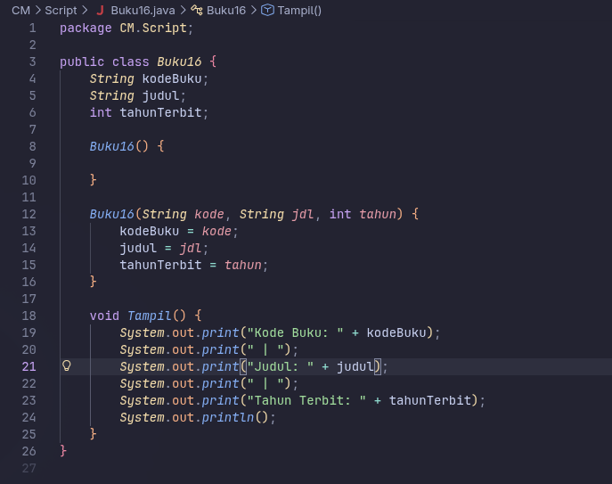
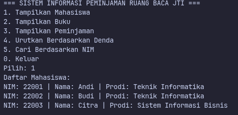
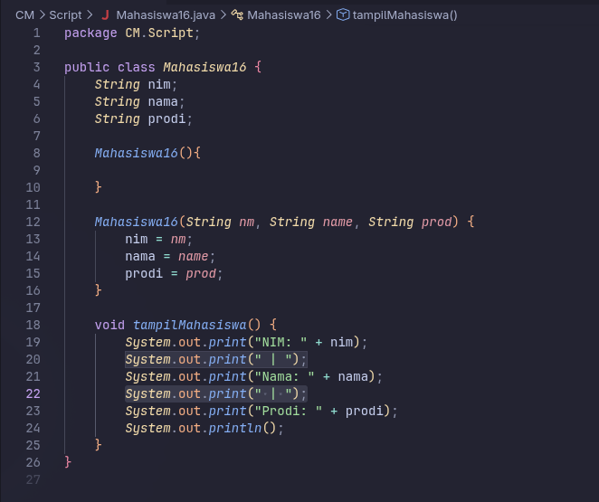
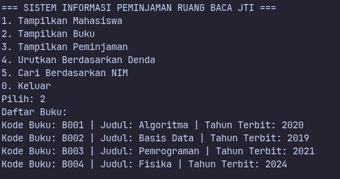
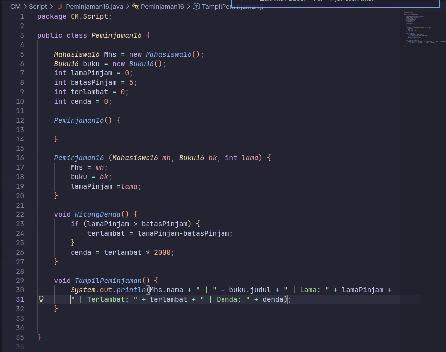
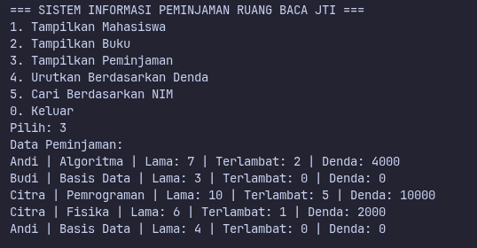
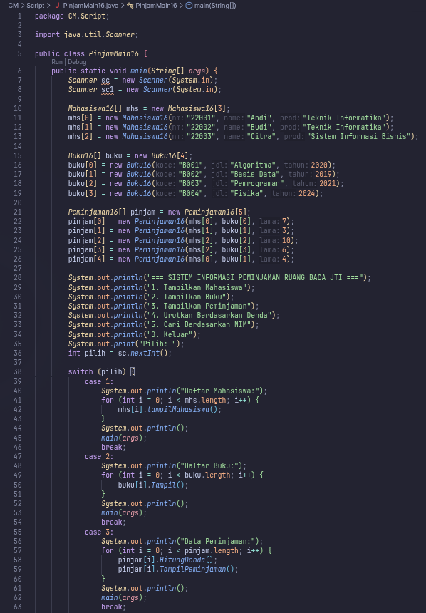
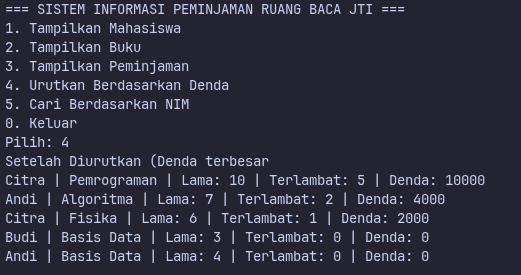
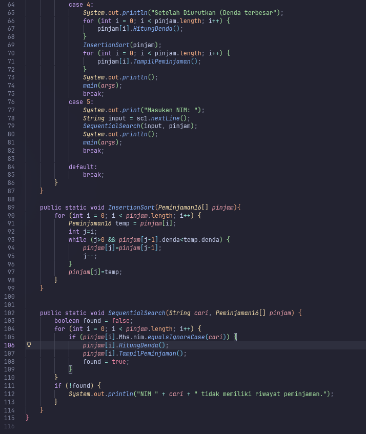
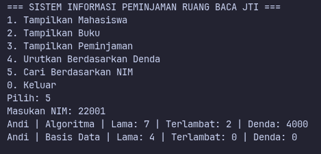

# Laporan Praktikum - Algoritma dan Struktur Data

| Data Mahasiswa | Keterangan |
|:--- |:--- |
| **NIM** | 254107020006 |
| **Nama** | Jonathan Emmanuel Kristanto |
| **Kelas** | TI - 1F |
| **Repository** | [ZhayaGT/PASD2026](https://github.com/ZhayaGT/PASD2026) |

---

# CASE METHOD

## CASE METHOD

**File Kode:** [Buku16.java](/CM//Script/Buku16.java) [Mahasiswa16.java](/CM/Script/Mahasiswa16.java)
[Peminjaman16.java](/CM/Script/Peminjaman16.java)
[PinjamMain16.java](/CM/Script/PinjamMain16.java)

| Kode Program | Hasil Running |
| :---: | :---: |
|  |  |
|  |  |
|  |  |
|  |  |
|  |  |
   |