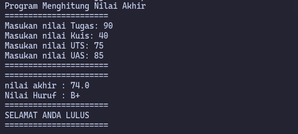
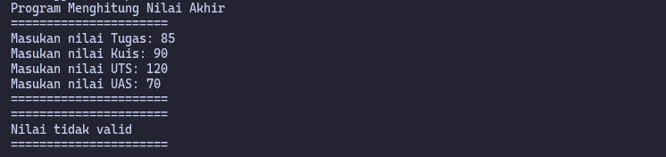

| | Algorithm and Data Structure |
|---|---|
| NIM | 254107020006 |
| Nama | Jonathan Emmanuel Kristanto |
| Kelas | TI - 1F |
| Repository | https://github.com/ZhayaGT/PASD2026 |

# Jobsheet #1 Konsep Dasar Pemrograman

## 2.1 Pemilihan

**Kode Program**
[Pemilihan.java](Script/Pemilihan.java)

**Hasil Kode Program**

**Pertanyaan:**
(tidak ada)

## 2.2 Perulangan

**Kode Program** [Perulangan.java](Script/Perulangan.java)

**Hasil Kode Program**

**Pertanyaan:**
(tidak ada)

## 2.3 Array

**Kode Program** [Array.java](Script/Array.java)

**Hasil Kode Program**

**Pertanyaan:**
(tidak ada)

## 2.4 Fungsi

**Kode Program** [Fungsi.java](Script/Fungsi.java)

**Hasil Kode Program**

**Pertanyaan:**
(tidak ada)

## 3.1 Tugas

**Kode Program** [PlatNomor.java](/Minggu_1/Script/PlatNomor.java)

**Hasil Kode Program**

**Pertanyaan:**
(tidak ada)

## 3.2 Tugas

**Kode Program** [JadwalKuliah.java](/Minggu_1/Script/JadwalKuliah.java)

**Hasil Kode Program**

**Pertanyaan:**
(tidak ada)