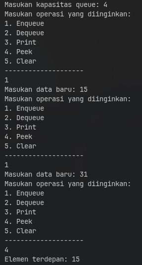

# Laporan Praktikum - Algoritma dan Struktur Data

| Data Mahasiswa | Keterangan |
|:--- |:--- |
| **NIM** | 254107020006 |
| **Nama** | Jonathan Emmanuel Kristanto |
| **Kelas** | TI - 1F |
| **Repository** | [ZhayaGT/PASD2026](https://github.com/ZhayaGT/PASD2026) |

---

# Jobsheet #10 QUEUE

## Percobaan 1 : Operasi Dasar Queue

**File Kode:** [Queue.java](Script/Queue.java) [QueueMain.java](Script/QueueMain.java)

### 1.1 Kode Program dan Hasil Running

**Kode Program:**
```java
    package Minggu_10.Script;

    public class Queue {
        int[] data;
        int front;
        int rear;
        int size;
        int max;

        Queue(int n) {
            max = n;
            data = new int[max];
            size = 0;
            front = rear = 0;
        }

        boolean IsEmpty() {
            if (size == 0) {
                return true;
            } else {
                return false;
            }
        }

        boolean IsFull() {
            if (size == max) {
                return true;
            } else {
                return false;
            }
        }

        void peek() {
            if (!IsEmpty()) {
                System.out.println("Elemen terdepan: " + data[front]);
            } else {
                System.out.println("Queue masih kosong");
            }
        }

        void print() {
            if (IsEmpty()) {
                System.out.println("Queue masih kosong");
            } else {
                int i = front;
                while (i != rear) {
                    System.out.println(data[i] + " ");
                    i = (i + 1) % max;
                }
                System.out.println(data[i] + " ");
                System.out.println("Jumlah elemen = " + size);
            }
        }

        void clear() {
            if (!IsEmpty()) {
                front = rear = -1;
                size = 0;
                System.out.println("Queue berhasil dikosongkan");
            } else {
                System.out.println("Queue masih kosong");
            }
        }

        void Enqueue(int dt){
            if (IsFull()) {
                System.out.println("Queue sudah penuh");
            } else {
                if (IsEmpty()) {
                    front = rear = 0;
                } else {
                    if (rear == max -1) {
                        rear = 0;
                    } else {
                        rear++;
                    }
                }
                data[rear] = dt;
                size++;
            }
        }

        int Dequeue() {
            int dt = 0;
            if (IsEmpty()) {
                System.out.println("Queue masih kosong");
            } else {
                dt = data[front];
                size--;
                if (IsEmpty()) {
                    front = rear = -1;
                } else {
                    if (front == max -1) {
                        front = 0;
                    } else {
                        front++;
                    }
                }
            }
            return dt;
        }
    }
```

```java
    package Minggu_10.Script;

    import java.util.Scanner;

    public class QueueMain {

        public static void main(String[] args) {
            Scanner sc = new Scanner(System.in);

            System.out.print("Masukan kapasitas queue: ");
            int n = sc.nextInt();

            Queue Q = new Queue(n);
            
            int pilih;
            do {
                Menu();
                pilih = sc.nextInt();
                switch (pilih) {
                    case 1:
                        System.out.print("Masukan data baru: ");
                        int dataMasuk = sc.nextInt();
                        Q.Enqueue(dataMasuk);
                        break;

                    case 2:
                        int dataKeluar = Q.Dequeue();
                        if (dataKeluar != 0) {
                            System.out.println("Data yang dikeluarkan: " + dataKeluar);
                        }
                        break;

                    case 3:
                        Q.print();
                        break;
                    
                    case 4:
                        Q.peek();
                        break;

                    case 5:
                        Q.clear();
                        break;
                
                    default:
                        break;
                }
            } while (pilih == 1 || pilih == 2 || pilih == 3 || pilih == 4 || pilih == 5);
        }

        public static void Menu() {
            System.out.println("Masukan operasi yang diinginkan:");
            System.out.println("1. Enqueue");
            System.out.println("2. Dequeue");
            System.out.println("3. Print");
            System.out.println("4. Peek");
            System.out.println("5. Clear");
            System.out.println("--------------------");
        }
    }
```
**Hasil Running:**



### Pertanyaan:

1. **Pada konstruktor, mengapa nilai awal atribut front dan rear bernilai -1, sementara atribut size bernilai 0?**
    * front & rear = -1: Karena antrean masih kosong dan indeks array dimulai dari 0, maka -1 digunakan sebagai penanda bahwa belum ada data yang menempati indeks manapun.
    
    * size = 0: Karena size berfungsi sebagai penghitung (counter) jumlah elemen yang ada di dalam antrean. Saat awal, jumlah elemen memang nol.

2. **Pada method Enqueue, jelaskan maksud dan kegunaan dari potongan kode berikut!**
    * Potongan kode tersebut (if (rear == max - 1) rear = 0; else rear++;) berfungsi untuk menerapkan Circular Queue. Kegunaannya adalah agar saat rear sudah mencapai batas akhir array, ia akan kembali ke indeks 0 sehingga ruang kosong di depan (akibat proses dequeue) bisa digunakan kembali.

3. **Pada method Dequeue, jelaskan maksud dan kegunaan dari potongan kode berikut!**
    * berfungsi untuk menggeser posisi front ke indeks selanjutnya. Jika front sudah di akhir array, ia akan kembali ke 0. Ini memastikan pengambilan data mengikuti urutan antrean yang melingkar.
    
4. **Pada method print, mengapa pada proses perulangan variabel i tidak dimulai dari 0 (int i=0),melainkan int i=front?**
    * Karena pada Queue (terutama Circular Queue), data terdepan tidak selalu berada di indeks 0. Data pertama yang harus dicetak adalah data yang ditunjuk oleh atribut front.

5. **Perhatikan kembali method print, jelaskan maksud dari potongan kode berikut!**
    * Potongan kode ini digunakan untuk iterasi melingkar. Tujuannya agar variabel index i dapat berjalan berurutan, dan ketika mencapai indeks terakhir (max - 1), ia akan otomatis kembali ke indeks 0 untuk melanjutkan pencetakan data hingga mencapai posisi rear.

6. **Tunjukkan potongan kode program yang merupakan queue overflow!**
    * ```java
            if (IsFull()) {
            System.out.println("Queue sudah penuh");
        }
        ```
7. **Pada saat terjadi queue overflow dan queue underflow, program tersebut tetap dapat berjalan dan hanya menampilkan teks informasi. Lakukan modifikasi program sehingga pada saat terjadi queue overflow dan queue underflow, program dihentikan!**
    * 
    ```java
        void Enqueue(int dt) {
            if (IsFull()) {
                System.out.println("Queue sudah penuh (Overflow)! Program dihentikan.");
                System.exit(0); // Program langsung berhenti total
            } else {
                if (IsEmpty()) {
                    front = rear = 0;
                } else {
                    rear = (rear + 1) % max;
                }
                data[rear] = dt;
                size++;
            }
        }

        int Dequeue() {
                int dt = 0;
                if (IsEmpty()) {
                    System.out.println("Queue masih kosong (Underflow)! Program dihentikan.");
                    System.exit(0); // Program langsung berhenti total
                } else {
                    dt = data[front];
                    size--;
                    if (IsEmpty()) {
                        front = rear = -1;
                    } else {
                        front = (front + 1) % max;
                    }
                }
                return dt;
            }        
    ```

---

## Percobaan 2 : Antrian Layanan Akademik

**File Kode:** [Queue.java](Script/Queue.java) [QueueMain.java](Script/QueueMain.java)

### 1.1 Kode Program dan Hasil Running

**Kode Program:**
```java
    package Minggu_10.Script;

    public class AntrianLayanan {
        Mahasiswa[] data;
        int front;
        int rear;
        int size;
        int max;

        AntrianLayanan(int max) {
            this.max = max;
            this.data = new Mahasiswa[max];
            this.front = 0;
            this.rear = -1;
            this.size = 0;
        }

        boolean IsEmpty() {
            if (size == 0) {
                return true;
            } else {
                return false;
            }
        }

        boolean IsFull() {
            if (size == max) {
                return true;
            } else {
                return false;
            }
        }

        void TambahAntrian(Mahasiswa mhs) {
            if (IsFull()) {
                System.out.println("Antrian penuh, tidak dapat menambahkan Mahasiswa");
                return;
            }
            rear = (rear + 1) % max;
            data[rear] = mhs;
            size++;
            System.out.println(mhs.nama + " berhasil masuk ke Antrian");
        }

        Mahasiswa LayaniMahasiswa() {
            if (IsEmpty()) {
                System.out.println("Antrian kosong");
                return null;
            }
            Mahasiswa mhs = data[front];
            front = (front + 1) % max;
            size--;
            return mhs;
        }

        void LihatTerdepan() {
            if (IsEmpty()) {
                System.out.println("Antrian kosong");
            } else {
                System.out.print("Mahasiswa terdepan: ");
                System.out.println("NIM - NAMA - PRODI - KELAS");
                data[front].TampikanData();
            }
        }

        void TampikanSemua() {
            if (IsEmpty()) {
                System.out.println("Antrian kosong");
                return;
            }
            System.out.println("Daftar Mahasiswa dalam antrian:");
            System.out.println("NIM - NAMA - PRODI - KELAS");
            for (int i = 0; i < size; i++) {
                int index = (front + i) % max;
                System.out.print((i + 1) + ". ");
                data[index].TampikanData();
            }
        }

        public int getJumlahAntrian() {
            return size;
        }
    }

```

```java
    package Minggu_10.Script;

    public class Mahasiswa {
        String nim;
        String nama;
        String prodi;
        String kelas;

        Mahasiswa(String nim, String nama, String prodi, String kelas) {
            this.nim = nim;
            this.nama = nama;
            this.prodi = prodi;
            this.kelas = kelas;
        }
        

        void TampikanData() {
            System.out.println(nim + " - " + nama + " - " + prodi + " _ " + kelas);
        }
    }
```

```java
    package Minggu_10.Script;

    import java.util.Scanner;

    public class LayananAkademiSIAKAD {
        public static void main(String[] args) {
            Scanner sc = new Scanner(System.in);

            AntrianLayanan antrian = new AntrianLayanan(5);
            int pilihan;

            do {
            System.out.println("\n=== Menu Antrian Layanan Akademik ===");
            System.out.println("1. Tambah Mahasiswa ke Antrian");
            System.out.println("2. Layani Mahasiswa");
            System.out.println("3. Lihat Mahasiswa Terdepan");
            System.out.println("4. Lihat Semua Antrian");
            System.out.println("5. Jumlah Mahasiswa dalam Antrian");
            System.out.println("0. Keluar");
            System.out.print("Pilih menu: ");
            pilihan = sc.nextInt(); sc.nextLine();

            switch (pilihan) {
                case 1:
                    System.out.print("NIM : ");
                    String nim = sc.nextLine();
                    System.out.print("Nama : ");
                    String nama = sc.nextLine();
                    System.out.print("Prodi : ");
                    String prodi = sc.nextLine();
                    System.out.print("Kelas : ");
                    String kelas = sc.nextLine();
                    Mahasiswa mhs = new Mahasiswa(nim, nama, prodi, kelas);
                    antrian.TambahAntrian(mhs);
                    break;
                case 2:
                    Mahasiswa dilayani = antrian.LayaniMahasiswa();
                    if (dilayani != null) {
                        System.out.print("Melayani mahasiswa: ");
                        dilayani.TampikanData();
                    }
                    break;
                case 3:
                    antrian.LihatTerdepan();
                    break;
                case 4:
                    antrian.TampikanSemua();
                    break;
                case 5:
                    System.out.println("Jumlah dalam antrian: " + antrian.getJumlahAntrian());
                    break;
                case 0:
                    System.out.println("Terima kasih.");
                    break;
                default:
                    System.out.println("Pilihan tidak valid.");
                }
            } while (pilihan != 0);

            sc.close();
        }
    }
```
**Hasil Running:**

```
    === Menu Antrian Layanan Akademik ===
1. Tambah Mahasiswa ke Antrian
2. Layani Mahasiswa
3. Lihat Mahasiswa Terdepan
4. Lihat Semua Antrian
5. Jumlah Mahasiswa dalam Antrian
0. Keluar
Pilih menu: 1
NIM : 123
Nama : Aldi
Prodi : TI
Kelas : 1A
Aldi berhasil masuk ke Antrian

=== Menu Antrian Layanan Akademik ===
1. Tambah Mahasiswa ke Antrian
2. Layani Mahasiswa
3. Lihat Mahasiswa Terdepan
4. Lihat Semua Antrian
5. Jumlah Mahasiswa dalam Antrian
0. Keluar
Pilih menu: 1
NIM : 124
Nama : Bobi
Prodi : TI
Kelas : 1G
Bobi berhasil masuk ke Antrian

=== Menu Antrian Layanan Akademik ===
1. Tambah Mahasiswa ke Antrian
2. Layani Mahasiswa
3. Lihat Mahasiswa Terdepan
4. Lihat Semua Antrian
5. Jumlah Mahasiswa dalam Antrian
0. Keluar
Pilih menu: 4
Daftar Mahasiswa dalam antrian:
NIM - NAMA - PRODI - KELAS
1. 123 - Aldi - TI _ 1A
2. 124 - Bobi - TI _ 1G

=== Menu Antrian Layanan Akademik ===
1. Tambah Mahasiswa ke Antrian
2. Layani Mahasiswa
3. Lihat Mahasiswa Terdepan
4. Lihat Semua Antrian
5. Jumlah Mahasiswa dalam Antrian
0. Keluar
Pilih menu: 2
Melayani mahasiswa: 123 - Aldi - TI _ 1A

=== Menu Antrian Layanan Akademik ===
1. Tambah Mahasiswa ke Antrian
2. Layani Mahasiswa
3. Lihat Mahasiswa Terdepan
4. Lihat Semua Antrian
5. Jumlah Mahasiswa dalam Antrian
0. Keluar
Pilih menu: 4
Daftar Mahasiswa dalam antrian:
NIM - NAMA - PRODI - KELAS
1. 124 - Bobi - TI _ 1G

=== Menu Antrian Layanan Akademik ===
1. Tambah Mahasiswa ke Antrian
2. Layani Mahasiswa
3. Lihat Mahasiswa Terdepan
4. Lihat Semua Antrian
5. Jumlah Mahasiswa dalam Antrian
0. Keluar
Pilih menu: 5
Jumlah dalam antrian: 1

=== Menu Antrian Layanan Akademik ===
1. Tambah Mahasiswa ke Antrian
2. Layani Mahasiswa
3. Lihat Mahasiswa Terdepan
4. Lihat Semua Antrian
5. Jumlah Mahasiswa dalam Antrian
0. Keluar
Pilih menu: 0
Terima kasih.
```

### Pertanyaan:

1. **Lakukan modifikasi program dengan menambahkan method baru bernama LihatAkhir pada class AntrianLayanan yang digunakan untuk mengecek antrian yang berada di posisi belakang. Tambahkan pula daftar menu 6. Cek Antrian paling belakang pada class LayananAkademikSIAKAD sehingga method LihatAkhir dapat dipanggil!**
    ```java
        package Minggu_10.Script;

    import java.util.Scanner;

    public class LayananAkademiSIAKAD {
        public static void main(String[] args) {
            Scanner sc = new Scanner(System.in);

            AntrianLayanan antrian = new AntrianLayanan(5);
            int pilihan;

            do {
                System.out.println("\n=== Menu Antrian Layanan Akademik ===");
                System.out.println("1. Tambah Mahasiswa ke Antrian");
                System.out.println("2. Layani Mahasiswa");
                System.out.println("3. Lihat Mahasiswa Terdepan");
                System.out.println("4. Lihat Semua Antrian");
                System.out.println("5. Jumlah Mahasiswa dalam Antrian");
                System.out.println("6. Cek Antrian paling belakang"); // Menu baru
                System.out.println("0. Keluar");
                System.out.print("Pilih menu: ");
                pilihan = sc.nextInt(); sc.nextLine();

                switch (pilihan) {
                    case 1:
                        System.out.print("NIM : ");
                        String nim = sc.nextLine();
                        System.out.print("Nama : ");
                        String nama = sc.nextLine();
                        System.out.print("Prodi : ");
                        String prodi = sc.nextLine();
                        System.out.print("Kelas : ");
                        String kelas = sc.nextLine();
                        Mahasiswa mhs = new Mahasiswa(nim, nama, prodi, kelas);
                        antrian.TambahAntrian(mhs);
                        break;
                    case 2:
                        Mahasiswa dilayani = antrian.LayaniMahasiswa();
                        if (dilayani != null) {
                            System.out.print("Melayani mahasiswa: ");
                            dilayani.TampikanData();
                        }
                        break;
                    case 3:
                        antrian.LihatTerdepan();
                        break;
                    case 4:
                        antrian.TampikanSemua();
                        break;
                    case 5:
                        System.out.println("Jumlah dalam antrian: " + antrian.getJumlahAntrian());
                        break;
                    case 6:
                        antrian.LihatAkhir(); // Memanggil method baru
                        break;
                    case 0:
                        System.out.println("Terima kasih.");
                        break;
                    default:
                        System.out.println("Pilihan tidak valid.");
                }
            } while (pilihan != 0);

            sc.close();
        }
    }
    ```

---

## TUGAS

    ```
        +-----------------------------------------+
        |                Mahasiswa                |
        +-----------------------------------------+
        | - nim : String                          |
        | - nama : String                         |
        | - prodi : String                        |
        | - kelas : String                        |
        +-----------------------------------------+
        | + Mahasiswa(nim, nama, prodi, kelas)    |
        | + TampilkanData() : void                |
        +-----------------------------------------+

        +-----------------------------------------+
        |               AntrianKRS                |
        +-----------------------------------------+
        | - data : Mahasiswa[]                    |
        | - front : int                           |
        | - rear : int                            |
        | - size : int                            |
        | - max : int                             |
        | - kapasitasDPA : int                    |
        | - jumlahDiproses : int                  |
        +-----------------------------------------+
        | + AntrianKRS(max: int, kapasitas: int)  |
        | + IsEmpty() : boolean                   |
        | + IsFull() : boolean                    |
        | + KosongkanAntrian() : void             |
        | + TambahAntrian(mhs: Mahasiswa) : void  |
        | + ProsesKRS() : void                    |
        | + TampilkanSemua() : void               |
        | + LihatDuaTerdepan() : void             |
        | + LihatAkhir() : void                   |
        | + GetJumlahAntrian() : int              |
        | + GetJumlahDiproses() : int             |
        | + GetBelumKRS() : int                   |
        +-----------------------------------------+

        +-----------------------------------------+
        |                 MainKRS                 |
        +-----------------------------------------+
        | + main(args: String[]) : void           |
        +-----------------------------------------+
    ```

**File Kode:** [Mahasiswa16.java](Script/Mahasiswa16.java) [AntrianKRS.java](Script/AntrianKRS.java) [MainKRS.java](Script/MainKRS.java)

### 1.1 Kode Program dan Hasil Running

**Kode Program:**
```java
        package Minggu_10.Script;

        public class Mahasiswa16 {
            String nim;
            String nama;
            String prodi;
            String kelas;

            public Mahasiswa16(String nim, String nama, String prodi, String kelas) {
                this.nim = nim;
                this.nama = nama;
                this.prodi = prodi;
                this.kelas = kelas;
            }

            public void TampilkanData() {
                System.out.println("NIM   : " + nim);
                System.out.println("Nama  : " + nama);
                System.out.println("Prodi : " + prodi);
                System.out.println("Kelas : " + kelas);
                System.out.println("-------------------------");
            }
        }

```

```java
        package Minggu_10.Script;

        import java.util.Scanner;

        public class AntrianKRS {
            Mahasiswa16[] data;
            int front;
            int rear;
            int size;
            int max;
            int kapasitasDPA;
            int jumlahDiproses;

            public AntrianKRS(int max, int kapasitasDPA) {
                this.max = max;
                this.kapasitasDPA = kapasitasDPA;
                data = new Mahasiswa16[max];
                size = 0;
                front = 0;
                rear = -1;
                jumlahDiproses = 0;
            }

            public boolean IsEmpty() {
                return size == 0;
            }

            public boolean IsFull() {
                return size == max;
            }

            public void KosongkanAntrian() {
                front = 0;
                rear = -1;
                size = 0;
                System.out.println("Antrian telah dikosongkan.");
            }

            public void TambahAntrian(Mahasiswa16 mhs) {
                if (IsFull()) {
                    System.out.println(">> GAGAL: Antrian sudah penuh! Maksimal " + max + " antrian.");
                } else if (jumlahDiproses + size >= kapasitasDPA) {
                    System.out.println(">> GAGAL: Kapasitas DPA sudah penuh (Maks " + kapasitasDPA + " mahasiswa).");
                } else {
                    rear = (rear + 1) % max;
                    data[rear] = mhs;
                    size++;
                    System.out.println(">> BERHASIL: " + mhs.nama + " telah masuk ke antrian.");
                }
            }

            public void ProsesKRS() {
                if (IsEmpty()) {
                    System.out.println(">> Antrian kosong. Tidak ada mahasiswa yang bisa diproses.");
                } else {
                    System.out.println(">> Sedang memproses KRS DPA...");
                    // Proses 2 orang sekaligus, atau 1 jika hanya sisa 1 di antrian
                    int jumlahPanggilan = Math.min(2, size); 
                    
                    for (int i = 0; i < jumlahPanggilan; i++) {
                        Mahasiswa16 mhs = data[front];
                        front = (front + 1) % max;
                        size--;
                        jumlahDiproses++;
                        System.out.println("   [Panggilan " + (i + 1) + "] Mahasiswa diproses:");
                        System.out.println("   - " + mhs.nama + " (" + mhs.nim + ")");
                    }
                    System.out.println(">> Selesai memproses " + jumlahPanggilan + " mahasiswa.");
                }
            }

            public void TampilkanSemua() {
                if (IsEmpty()) {
                    System.out.println(">> Antrian saat ini kosong.");
                } else {
                    System.out.println("=== DAFTAR ANTRIAN KRS ===");
                    int i = front;
                    for (int count = 0; count < size; count++) {
                        System.out.println("Antrian ke-" + (count + 1) + ":");
                        data[i].TampilkanData();
                        i = (i + 1) % max;
                    }
                }
            }

            public void LihatDuaTerdepan() {
                if (IsEmpty()) {
                    System.out.println(">> Antrian kosong.");
                } else {
                    System.out.println("=== 2 ANTRIAN TERDEPAN ===");
                    int limit = Math.min(2, size);
                    int i = front;
                    for (int count = 0; count < limit; count++) {
                        System.out.println("Terdepan ke-" + (count + 1) + ":");
                        data[i].TampilkanData();
                        i = (i + 1) % max;
                    }
                }
            }

            public void LihatAkhir() {
                if (IsEmpty()) {
                    System.out.println(">> Antrian kosong.");
                } else {
                    System.out.println("=== ANTRIAN PALING AKHIR ===");
                    data[rear].TampilkanData();
                }
            }

            public int GetJumlahAntrian() {
                return size;
            }

            public int GetJumlahDiproses() {
                return jumlahDiproses;
            }

            public int GetBelumKRS() {
                return kapasitasDPA - jumlahDiproses;
            }
        }

```

```java
        package Minggu_10.Script;

import java.util.Scanner;

public class MainKRS {
    public static void main(String[] args) {
        Scanner sc = new Scanner(System.in);

        AntrianKRS antrian = new AntrianKRS(10, 30);
        int menu;

        do {
            System.out.println("\n=========================================");
            System.out.println("        SISTEM ANTRIAN KRS DPA           ");
            System.out.println("=========================================");
            System.out.println("1. Tambah Mahasiswa ke Antrian");
            System.out.println("2. Proses Antrian KRS (Panggil 2 Orang)");
            System.out.println("3. Tampilkan Semua Antrian");
            System.out.println("4. Lihat 2 Antrian Terdepan");
            System.out.println("5. Lihat Antrian Paling Akhir");
            System.out.println("6. Cek Status/Statistik Antrian");
            System.out.println("7. Kosongkan Antrian");
            System.out.println("0. Keluar Program");
            System.out.println("=========================================");
            System.out.print("Pilih Menu: ");
            menu = sc.nextInt();
            sc.nextLine();

            switch (menu) {
                case 1:
                    if (antrian.IsFull()) {
                        System.out.println(">> Antrian penuh, silakan tunggu diproses.");
                    } else {
                        System.out.println("--- Masukkan Data Mahasiswa ---");
                        System.out.print("NIM   : "); String nim = sc.nextLine();
                        System.out.print("Nama  : "); String nama = sc.nextLine();
                        System.out.print("Prodi : "); String prodi = sc.nextLine();
                        System.out.print("Kelas : "); String kelas = sc.nextLine();
                        Mahasiswa16 mhsBaru = new Mahasiswa16(nim, nama, prodi, kelas);
                        antrian.TambahAntrian(mhsBaru);
                    }
                    break;
                case 2:
                    antrian.ProsesKRS();
                    break;
                case 3:
                    antrian.TampilkanSemua();
                    break;
                case 4:
                    antrian.LihatDuaTerdepan();
                    break;
                case 5:
                    antrian.LihatAkhir();
                    break;
                case 6:
                    System.out.println("\n=== STATISTIK ANTRIAN ===");
                    System.out.println("Jumlah Menunggu di Antrian      : " + antrian.GetJumlahAntrian());
                    System.out.println("Jumlah Mahasiswa Sudah Proses KRS : " + antrian.GetJumlahDiproses());
                    System.out.println("Sisa Kuota DPA Belum Proses KRS   : " + antrian.GetBelumKRS());
                    System.out.println("Status Antrian Penuh?           : " + (antrian.IsFull() ? "Ya" : "Tidak"));
                    System.out.println("Status Antrian Kosong?          : " + (antrian.IsEmpty() ? "Ya" : "Tidak"));
                    break;
                case 7:
                    antrian.KosongkanAntrian();
                    break;
                case 0:
                    System.out.println("Keluar dari program. Terima kasih!");
                    break;
                default:
                    System.out.println("Pilihan tidak valid! Silakan pilih menu yang tersedia.");
            }
        } while (menu != 0);

        sc.close();
    }
}


```