# Laporan Praktikum - Algoritma dan Struktur Data

| Data Mahasiswa | Keterangan |
|:--- |:--- |
| **NIM** | 254107020006 |
| **Nama** | Jonathan Emmanuel Kristanto |
| **Kelas** | TI - 1F |
| **Repository** | [ZhayaGT/PASD2026](https://github.com/ZhayaGT/PASD2026) |

---

# Jobsheet #2: Object

## I. Percobaan 1: Deklarasi Class, Atribut, dan Method

**File Kode:** [Mahasiswa16.java](Script/Mahasiswa16.java)

### 1.1 Langkah-langkah Percobaan & Dokumentasi
| Kode Program | Hasil Running |
| :---: | :---: |
| 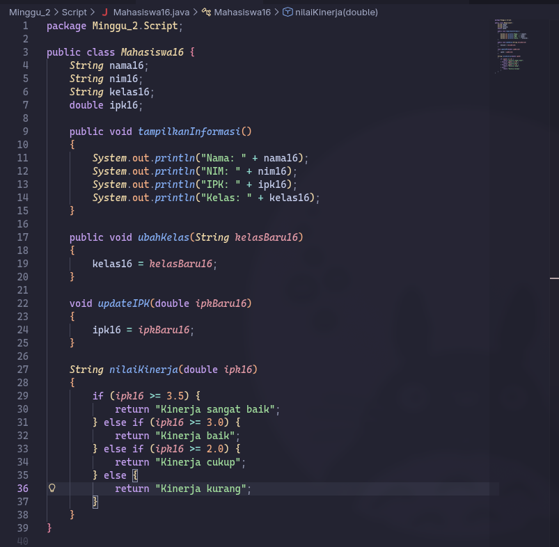 | 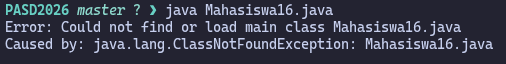 |

### 1.2 Pertanyaan
1. **Sebutkan dua karakteristik class atau object!**
    
    * **Class:** 
        * **Template/Cetak Biru:** Berfungsi untuk mendefinisikan struktur (atribut) dan perilaku (method) tanpa memiliki wujud nyata di memori.
        * **Wadah Definisi:** Class berfungsi sebagai tempat untuk menentukan data apa saja yang akan dimiliki oleh objek-objek turunannya nanti.

    * **Object:**

        * **Instansi Nyata:** Object adalah perwujudan konkret dari Class yang menempati ruang di memori komputer.
        * **Memiliki State & Behavior:** Setiap objek memiliki nilai data spesifik (State) dan dapat menjalankan fungsi-fungsi (Behavior) yang telah didefinisikan dalam Class.

2. **Perhatikan class Mahasiswa pada Praktikum 1 tersebut, ada berapa atribut yang dimiliki oleh class Mahasiswa? Sebutkan apa saja atributnya!**
    * Terdapat **4 atribut**, yaitu: `nama`, `nim`, `kelas`, dan `ipk`.

3. **Ada berapa method yang dimiliki oleh class tersebut? Sebutkan apa saja methodnya!**
    * Terdapat **4 method**, yaitu: `tampilkanInformasi()`, `ubahKelas()`, `updateIpk()`, dan `nilaiKinerja()`.

4. **Modifikasi method `updateIpk()` sehingga dilakukan pengecekan rentang 0.0 - 4.0.**
    
    **Kode Modifikasi:**
    ```java
    void updateIpk(double ipkBaru) {
        if (ipkBaru16 >= 0.0 && ipkBaru16 <= 4.0) {
            ipk16 = ipkBaru16;
        } else {
            System.out.println("IPK tidak valid. Harus antara 0.0 dan 4.0");
        }
    }
    ```

5. **Jelaskan cara kerja method `nilaiKinerja()`!**
    * **Cara Kerja:** Method mengevaluasi nilai atribut `ipk` menggunakan struktur pemilihan (*if-else*).
    * **Kriteria:** 
        * Sangat Baik (IPK >= 3.5)
        * Baik (3.0 <= IPK < 3.5)
        * Cukup (2.0 <= IPK < 3.0)
        * Kurang (IPK < 2.0)
    * **Return Value:** Mengembalikan nilai berupa `String` yang merepresentasikan kategori kinerja.

6. **Commit dan push kode program ke Github**
    * Link commit: [https://github.com/ZhayaGT/...](https://github.com/ZhayaGT/PASD2026/commit/5ab689da3c899dcdb108d99599038714def0b557)

---

## II. Percobaan 2: Instansiasi Object, serta Mengakses Atribut dan Method

**File Kode:** [MahasiswaMain16.java](Script/MahasiswaMain16.java)

### 1.1 Langkah-langkah Percobaan & Dokumentasi
| Kode Program | Hasil Running |
| :---: | :---: |
| 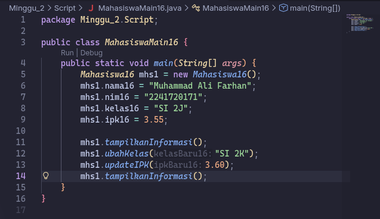 | 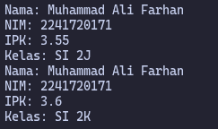 |

* Link commit: [https://github.com/ZhayaGT/...](https://github.com/ZhayaGT/PASD2026/commit/4c7fcc8563918039dc04a3b6f442f35e405be7bb)

### 1.2 Pertanyaan
1. **Pada class MahasiswaMain, tunjukkan baris kode program yang digunakan untuk proses
instansiasi! Apa nama object yang dihasilkan?**
    * 
    ```java
    Mahasiswa16 mhs1 = new Mahasiswa16();
    ```
    Baris ke-5, dengan nama object mhs1

2. **Bagaimana cara mengakses atribut dan method dari suatu objek?**
    * Dengan menggunakan sintaks `namaObjek.namaAtribut` jika ingin mengakses atribut dan `namaObjek.namaMethod` untuk mengakses method

3. **Mengapa hasil output pemanggilan method tampilkanInformasi() pertama dan kedua berbeda?**
    * karena method pertama dipanggil sebelum dilakukan update kelas dan ipk dimana fungsi tersebut mengubah value dari atribut kelas dan ipk, maka ia mengikuti value yg di set diawal kode, sedangkan method kedua menggunakan value yang setelah diupdate
---

## Percobaan 3: Membuat Konstruktor

### 1.1 Langkah-langkah Percobaan & Dokumentasi
| Kode Program | Hasil Running |
| :---: | :---: |
| 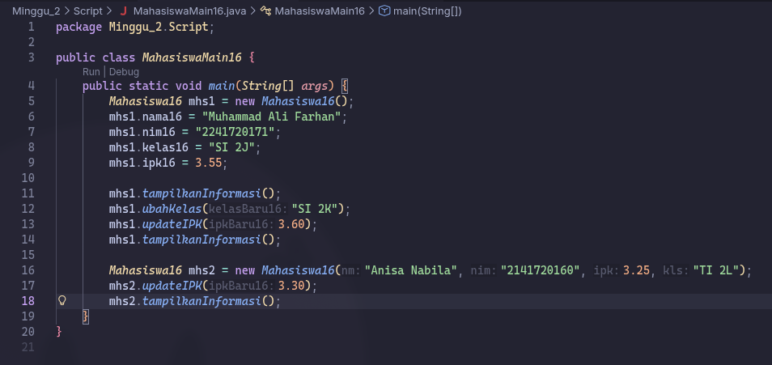 |  |

* Link commit: [https://github.com/ZhayaGT/...](https://github.com/ZhayaGT/PASD2026/commit/f58d0121808950111dd66f8b3e8166286cc43926)

### 1.2 Pertanyaan
1. **Pada class Mahasiswa di Percobaan 3, tunjukkan baris kode program yang digunakan untuk
mendeklarasikan konstruktor berparameter!**
    * 
    ```java
    public Mahasiswa16(String nm, String nim, double ipk, String kls) {
        nama16 = nm;
        this.nim16 = nim;
        this.ipk16 = ipk;
        kelas16 = kls;
    }
    ```

2. Perhatikan class MahasiswaMain. Apa sebenarnya yang dilakukan pada baris program
berikut? 
    * Membuat variabel mhs2 dengan tipe data Mahasiswa, membuat object baru serta mengisi 4 parameter yang dibutuhkan
    
3. **Hapus konstruktor default pada class Mahasiswa, kemudian compile dan run program.
Bagaimana hasilnya? Jelaskan mengapa hasilnya demikian!**
    * Program akan mengalami error compile pada baris yang melakukan instansiasi objek menggunakan konstruktor tanpa parameter. karena di dalam class Mahasiswa16 sudah terdapat konstruktor berparameter. Dalam Java, jika kita menuliskan konstruktor sendiri, maka Java tidak akan lagi menyediakan konstruktor default secara otomatis. Oleh karena itu, ketika konstruktor default dihapus secara manual, objek tidak bisa lagi dibuat tanpa mengirimkan argumen sesuai parameter yang ada.

4. **Setelah melakukan instansiasi object, apakah method di dalam class Mahasiswa harus diakses
secara berurutan? Jelaskan alasannya!**
    * Tidak harus berurutan. Method di dalam suatu objek dapat diakses secara bebas sesuai dengan kebutuhan logika program. Setiap method bersifat independen, sehingga urutan pemanggilannya tidak dibatasi oleh urutan penulisannya di dalam class.

5. **Buat object baru dengan nama mhs<NamaMahasiswa> menggunakan konstruktor
berparameter dari class Mahasiswa!**
    * 
    ```java
    Mahasiswa16 mhsJonathan = new Mahasiswa16("Jonathan Emmanuel Kristanto", "254107020006", 3.25, "TI 1F");
    ```

6. **Commit dan push kode program ke Github**
[https://github.com/ZhayaGT/...](https://github.com/ZhayaGT/PASD2026/commit/f6f093268d8190bc464de77307f2628ee20b96a9)

---

## Latihan Praktikum
## Latihan 1

**File Kode:** [MataKuliah16.java](Script/MataKuliah16.java) [MataKuliahMain16.java](Script/MataKuliahMain16.java)

### 1.1 Langkah-langkah & Dokumentasi
| Kode Program | Hasil Running |
| :---: | :---: |
| 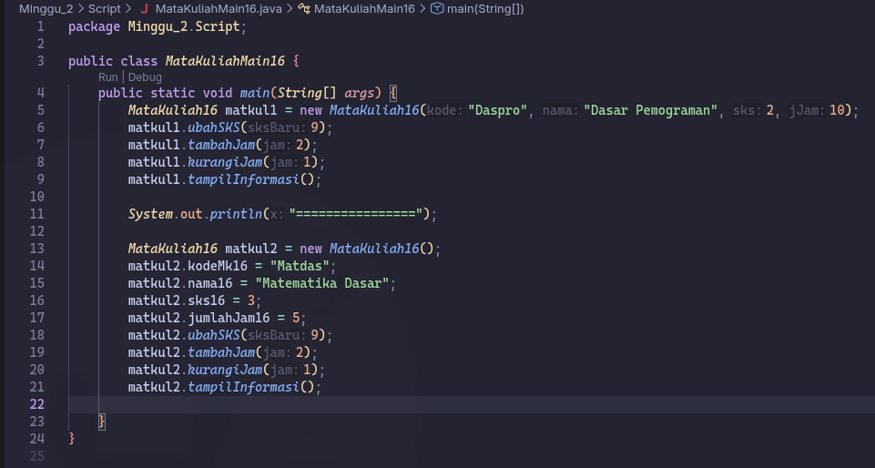 | 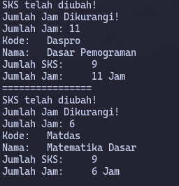 |
| 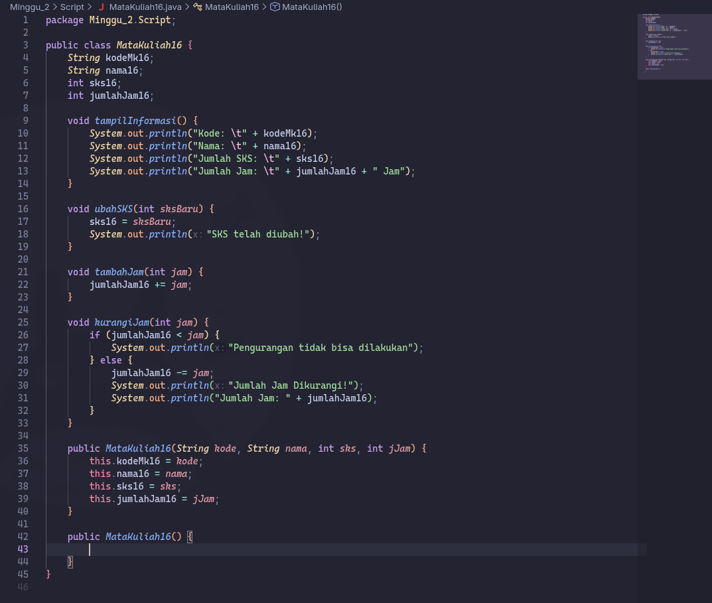 |  

* Link commit: [https://github.com/ZhayaGT/...](https://github.com/ZhayaGT/PASD2026/commit/f7544944d961a0aca13abcb6abdecc0c30e85a09)

---

## Latihan 2

**File Kode:** [Dosen16.java](Script/Dosen16.java) 
[DosenMain16.java](Script/DosenMain16.java)

### 1.1 Langkah-langkah & Dokumentasi
| Kode Program | Hasil Running |
| :---: | :---: |
| 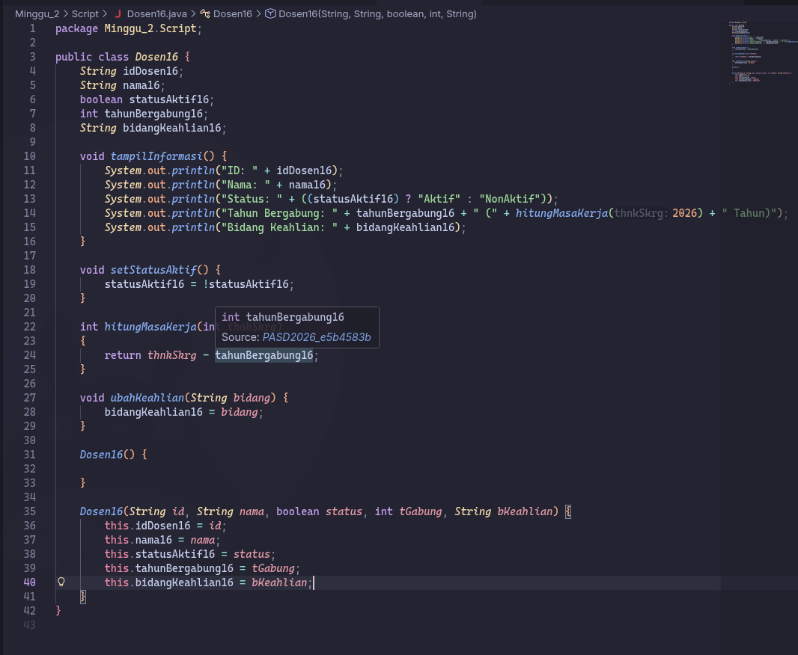 | 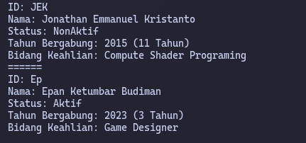 |
| 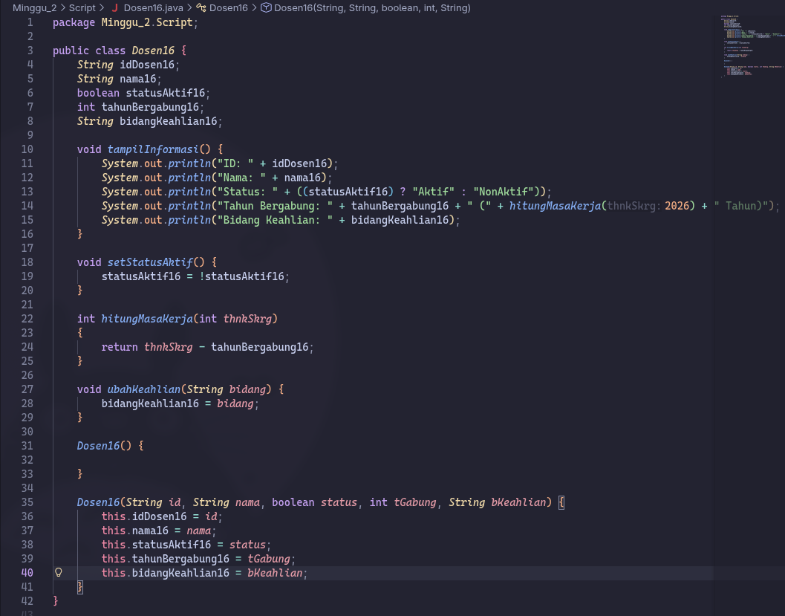 |  

* Link commit: [https://github.com/ZhayaGT/...](https://github.com/ZhayaGT/PASD2026/commit/3584dc46ef69408c221504ee56ea13555665fce8)

---