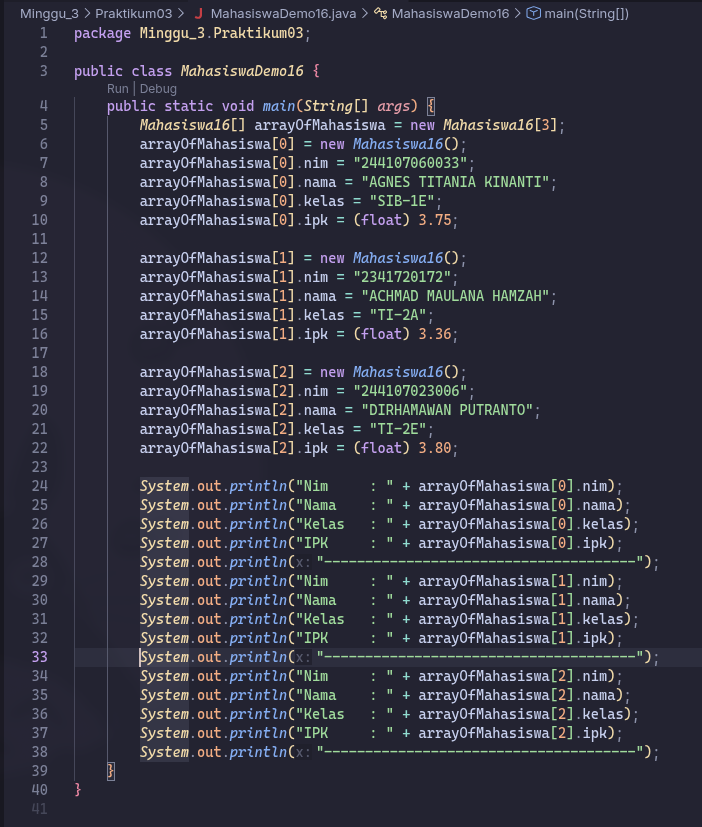
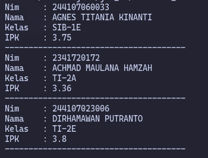
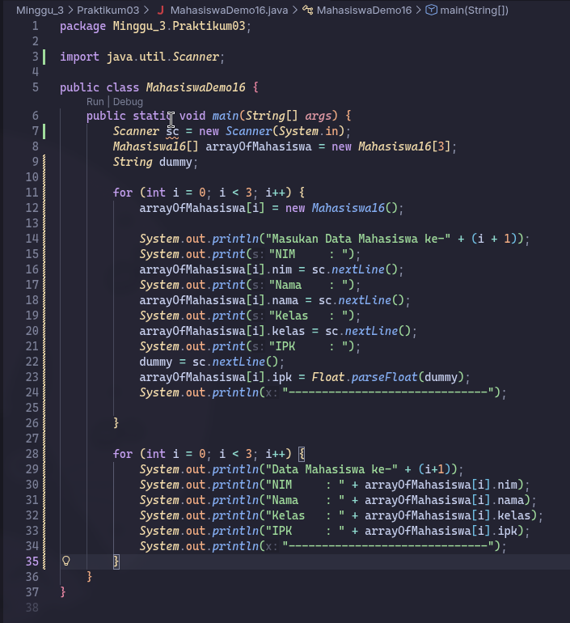
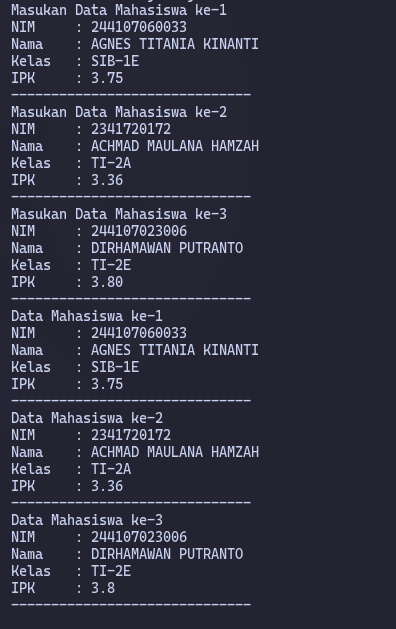
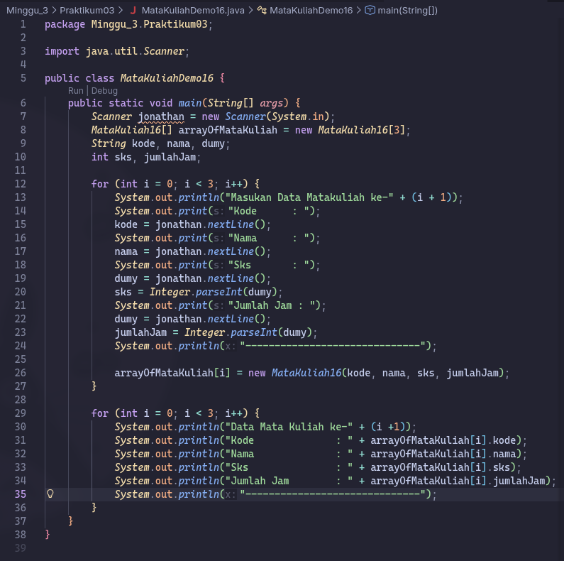
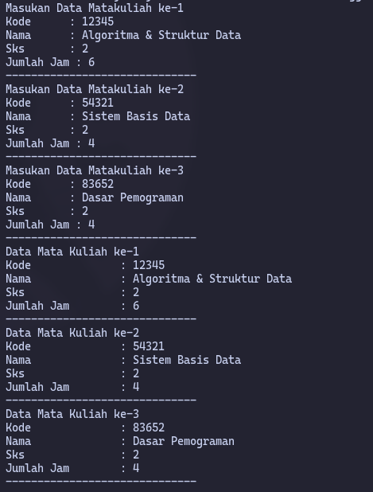

# Laporan Praktikum - Algoritma dan Struktur Data

| Data Mahasiswa | Keterangan |
|:--- |:--- |
| **NIM** | 254107020006 |
| **Nama** | Jonathan Emmanuel Kristanto |
| **Kelas** | TI - 1F |
| **Repository** | [ZhayaGT/PASD2026](https://github.com/ZhayaGT/PASD2026) |

---

# Jobsheet #3: ARRAY OF OBJECTS

## Percobaan #1 Membuat Array dari Object, Mengisi dan Menampilkan

**File Kode:** [Mahasiswa16.java](/Minggu_3/Praktikum03/Mahasiswa16.java) [MahasiswaDemo16.java](/Minggu_3/Praktikum03/MahasiswaDemo16.java)

### 1.1 Langkah-langkah Percobaan & Dokumentasi
| Kode Program | Hasil Running |
| :---: | :---: |
|  |  |

### 1.2 Pertanyaan
1. **Berdasarkan uji coba 3.2, apakah class yang akan dibuat array of object harus selalu memiliki
atribut dan sekaligus method? Jelaskan!**
    
    * Class harus memiliki atribut karena fungsinya adalah sebagai blueprint/template dimana atributnya berperan sebagai variabel yang bisa digunakan di class lain, namun tidak harus memiliki method, jika memang tidak dibutuhkan

2. **Apa yang dilakukan oleh kode program berikut?**
```java
Mahasiswa16[] arrayOfMahasiswa = new Mahasiswa16[3];
```
* Melakukan Instansiasi, secara sederhana kita membuat variabel Array dari class Mahasiswa16.

3. **Apakah class Mahasiswa memiliki konstruktor? Jika tidak, kenapa bisa dilakukan pemanggilan konstruktur pada baris program berikut?**
```java
arrayOfMahasiswa[0] = new Mahasiswa16();
```
* Compiler Java secara otomatis membuatkan konstruktor default (tanpa parameter)

4. **Apa yang dilakukan oleh kode program berikut?.**
    ```java
    arrayOfMahasiswa[0] = new Mahasiswa16();
        arrayOfMahasiswa[0].nim = "244107060033";
        arrayOfMahasiswa[0].nama = "AGNES TITANIA KINANTI";
        arrayOfMahasiswa[0].kelas = "SIB-1E";
        arrayOfMahasiswa[0].ipk = (float) 3.75;
    ```
    * Mengisi atribut/variabel nim,nama,kelas,ipk dengan value

5. **Mengapa class Mahasiswa dan MahasiswaDemo dipisahkan pada uji coba 3.2?**
    * Karena di java, 1 script hanya bisa menampung 1 class

---

## Percobaan #2 Menerima Input Isian Array Menggunakan Looping

**File Kode:** [Mahasiswa16.java](/Minggu_3/Praktikum03/Mahasiswa16.java) [MahasiswaDemo16.java](/Minggu_3/Praktikum03/MahasiswaDemo16.java)

### 1.1 Langkah-langkah Percobaan & Dokumentasi
| Kode Program | Hasil Running |
| :---: | :---: |
|  |  |

* Link commit: [https://github.com/ZhayaGT/...](https://github.com/ZhayaGT/PASD2026/commit/4c7fcc8563918039dc04a3b6f442f35e405be7bb)

### 1.2 Pertanyaan
1. **Tambahkan method cetakInfo() pada class Mahasiswa kemudian modifikasi kode program pada langkah no 3.**
    * 
    ```java
    void cetakInfo(int nomer){
        System.out.println("Data Mahasiswa ke-" + nomer);
        System.out.println("NIM     : " + nim);
        System.out.println("Nama    : " + nama);
        System.out.println("Kelas   : " + kelas);
        System.out.println("IPK     : " + ipk);
        System.out.println("------------------------------");
    }   
    ```

2. **Misalkan Anda punya array baru bertipe array of Mahasiswa dengan nama myArrayOfMahasiswa. Mengapa kode berikut menyebabkan error?**
```java
Mahasiswa16[] myArrayOfMahasiswa16 = new Mahasiswa16[3];
        myArrayOfMahasiswa16[0].nim = "244107060033";
        myArrayOfMahasiswa16[0].nama = "AGNES TITANIA KINANTI";
        myArrayOfMahasiswa16[0].kelas = "SIB-1E";
        myArrayOfMahasiswa16[0].ipk = (float) 3.75;
```
* Menyebabkan error NullPointerException karena baru membuat "wadah" array-nya saja, tetapi belum membuat "isi" (objek) di dalam indeks tersebut.

---

## Percobaan 3: Constructor Berparameter

### 1.1 Langkah-langkah Percobaan & Dokumentasi
| Kode Program | Hasil Running |
| :---: | :---: |
|  |  |

* Link commit: [https://github.com/ZhayaGT/...](https://github.com/ZhayaGT/PASD2026/commit/f58d0121808950111dd66f8b3e8166286cc43926)

### 1.2 Pertanyaan
1. **Apakah suatu class dapat memiliki lebih dari 1 constructor? Jika iya, berikan contohnya**
    * Ya, bisa memiliki lebih dari 1 constructor, sebagai contoh
    ```java
    public class Produk {
    private String nama;
    private double harga;
    private int stok;

    public Produk() {
        this.nama = "Tanpa Nama";
        this.harga = 0.0;
        this.stok = 0;
    }

    public Produk(String nama, double harga) {
        this.nama = nama;
        this.harga = harga;
        this.stok = 0;
    }

    public Produk(String nama, double harga, int stok) {
        this.nama = nama;
        this.harga = harga;
        this.stok = stok;
    }

    public void info() {
        System.out.println(nama + " | Harga: " + harga + " | Stok: " + stok);
    }
}   
    ```

2. **Tambahkan method tambahData() pada class Matakuliah, kemudian gunakan method tersebut di class MatakuliahDemo untuk menambahkan data Matakuliah**
    ```java
    public void tambahData(Scanner jonathan, int nomer) {
        String dummy;
        System.out.println("Masukan Data Matakuliah ke-" + nomer);
            System.out.print("Kode      : ");
            kode = jonathan.nextLine();
            System.out.print("Nama      : ");
            nama = jonathan.nextLine();
            System.out.print("Sks       : ");
            dummy = jonathan.nextLine();
            sks = Integer.parseInt(dummy);
            System.out.print("Jumlah Jam : ");
            dummy = jonathan.nextLine();
            jumlahJam = Integer.parseInt(dummy);
            System.out.println("------------------------------"); 
            }
    ```

    ```java
    for (int i = 0; i < 3; i++) {
            arrayOfMataKuliah[i] = new MataKuliah16();
            arrayOfMataKuliah[i].tambahData(jonathan, (i + 1));
        }
    ```
        
3. **Tambahkan method cetakInfo() pada class Matakuliah, kemudian gunakan method tersebut di class MatakuliahDemo untuk menampilkan data hasil inputan di layar**
    ```java
    public void cetakInfo()
    {
        System.out.println("Kode              : " + kode);
        System.out.println("Nama              : " + nama);
        System.out.println("Sks               : " + sks);
        System.out.println("Jumlah Jam        : " + jumlahJam);
        System.out.println("------------------------------");
    }
    ```

    ```java
    for (int i = 0; i < 3; i++) {
            System.out.println("Data Mata Kuliah ke-" + (i +1));
            arrayOfMataKuliah[i].cetakInfo();
        }
    ```

4. **Modifikasi kode program pada class MatakuliahDemo agar panjang (jumlah elemen) dari array of object Matakuliah ditentukan oleh user melalui input dengan Scanner**
    ```java
        public class MataKuliahDemo16 {
        public static void main(String[] args) {
            Scanner jonathan = new Scanner(System.in);
            int n;
            System.out.print("Masukan banyak mata kuliah: ");
            n = jonathan.nextInt();
            MataKuliah16[] arrayOfMataKuliah = new MataKuliah16[n];
            String kode, nama, dumy;
            int sks, jumlahJam;

            for (int i = 0; i < n; i++) {
                arrayOfMataKuliah[i] = new MataKuliah16();
                arrayOfMataKuliah[i].tambahData(jonathan, (i + 1));
            }

            for (int i = 0; i < n; i++) {
                System.out.println("Data Mata Kuliah ke-" + (i +1));
                arrayOfMataKuliah[i].cetakInfo();
            }
        }
    ```
---

## Latihan Praktikum
## Latihan 1

**File Kode:** [MataKuliah16.java](Script/MataKuliah16.java) [MataKuliahMain16.java](Script/MataKuliahMain16.java)

### 1.1 Langkah-langkah & Dokumentasi
| Kode Program | Hasil Running |
| :---: | :---: |
|  |  |
|  |  

* Link commit: [https://github.com/ZhayaGT/...](https://github.com/ZhayaGT/PASD2026/commit/f7544944d961a0aca13abcb6abdecc0c30e85a09)

---

## Latihan 2

**File Kode:** [Dosen16.java](Script/Dosen16.java) 
[DosenMain16.java](Script/DosenMain16.java)

### 1.1 Langkah-langkah & Dokumentasi
| Kode Program | Hasil Running |
| :---: | :---: |
|  |  |
|  |  

* Link commit: [https://github.com/ZhayaGT/...](https://github.com/ZhayaGT/PASD2026/commit/3584dc46ef69408c221504ee56ea13555665fce8)

---