# Laporan Praktikum - Algoritma dan Struktur Data

| Data Mahasiswa | Keterangan |
|:--- |:--- |
| **NIM** | 254107020006 |
| **Nama** | Jonathan Emmanuel Kristanto |
| **Kelas** | TI - 1F |
| **Repository** | [ZhayaGT/PASD2026](https://github.com/ZhayaGT/PASD2026) |

---

# Jobsheet #5: BRUTE FORCE DAN DIVIDE CONQUER

## Percobaan #1 Menghitung Nilai Faktorial dengan Algoritma Brute Force dan Divide and Conquer

**File Kode:** [Faktorial.java](/Minggu_5/BruteForceDivideConquer/Script/Faktorial.java) [MainFaktorial.java](/Minggu_5/BruteForceDivideConquer/Script/MainFaktorial.java)

### 1.1 Langkah-langkah Percobaan & Dokumentasi
| Kode Program | Hasil Running |
| :---: | :---: |
| 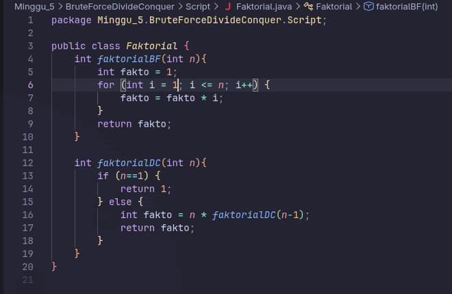 | 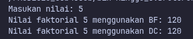 |
| 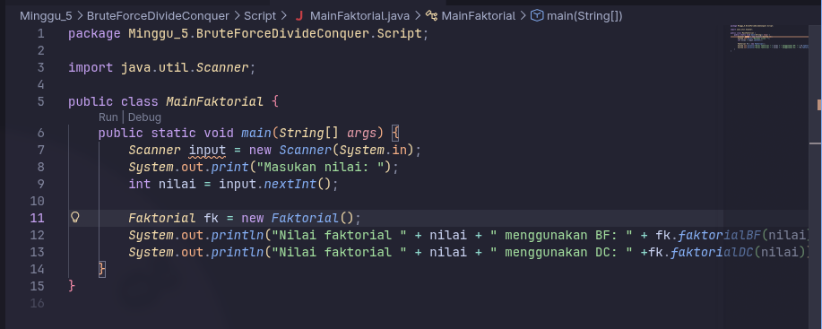 

### 1.2 Pertanyaan
1. **Pada base line Algoritma Divide Conquer untuk melakukan pencarian nilai faktorial, jelaskan perbedaan bagian kode pada penggunaan if dan else!**
    
    * IF : Kondisi untuk memberhentikan proses rekursif
    * ELSE : Memanggil fungsi sampai memenuhi kondisi

2. **Apakah memungkinkan perulangan pada method faktorialBF() diubah selain menggunakan for? Buktikan!**

    * Bisa, dengan tipe perulangan lain seperti while
    * ```java
        int faktorialBF(int n){
            int fakto = 1;
            int i = 1;

            while (i <= n) {
                fakto = fakto * i;
                i++;
            }
            
            return fakto;
        }
        ```
        
3. **Jelaskan perbedaan antara fakto *= i; dan int fakto = n * faktorialDC(n-1);**

    * fakto *= i; Memperbarui nilai variabel yang sudah ada saat ini
    * fakto = n * faktorialDC(n-1) Memperbarui variabel setelah pemanggilan fungsi selesai

4. **Buat Kesimpulan tentang perbedaan cara kerja method faktorialBF() dan faktorialDC()!**

    * faktorialBF() menggunakan cara yang lebih sederhana dengan menggunakan looping
    * faktorialDC() menggunakan teknik bernama rekursif

---

## Percobaan #2 Menghitung Hasil Pangkat dengan Algoritma Brute Force dan Divide and Conquer

**File Kode:** [Faktorial.java](/Minggu_5/BruteForceDivideConquer/Script/Faktorial.java) [MainFaktorial.java](/Minggu_5/BruteForceDivideConquer/Script/MainFaktorial.java)

### 1.1 Langkah-langkah Percobaan & Dokumentasi
| Kode Program | Hasil Running |
| :---: | :---: |
| 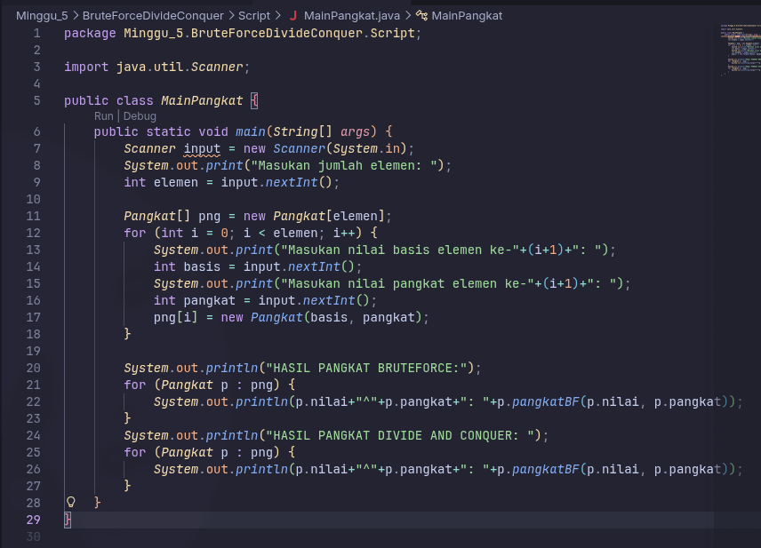 | 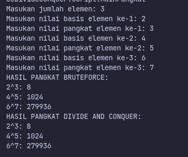 |
| 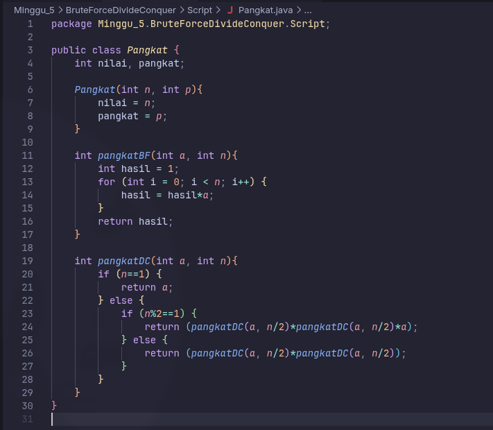 

### 1.2 Pertanyaan
1. **Jelaskan mengenai perbedaan 2 method yang dibuat yaitu pangkatBF() dan pangkatDC()!**
    
    * BF : Menggunakan teknik looping atau Brute Force
    * DC : Menggunakan teknik rekursif atau Divide and Conquer

2. **Apakah tahap combine sudah termasuk dalam kode tersebut?Tunjukkan!**

    * Ya, tahap Combine sudah termasuk dalam kode pangkatDC()
    * ```java
        return (pangkatDC(a, n/2) * pangkatDC(a, n/2) * a);
        return (pangkatDC(a, n/2) * pangkatDC(a, n/2));
        ```
        
3. **Pada method pangkatBF() terdapat parameter untuk melewatkan nilai yang akan dipangkatkan dan pangkat berapa, padahal di sisi lain di class Pangkat telah ada atribut nilai dan pangkat, apakah menurut Anda method tersebut tetap relevan untuk memiliki parameter? Apakah bisa jika method tersebut dibuat dengan tanpa parameter? Jika bisa, seperti apa method pangkatBF() yang tanpa parameter?**

    * Tetap relevan, karena dengan menambahkan parameter, membuat kode menjadi fleksibel dan reuseable
    * Contoh tanpa parameter
    ```java
        public class Pangkat {
        int nilai, pangkat;

        Pangkat(int n, int p){
            this.nilai = n;
            this.pangkat = p;
        }

        // Method tanpa parameter, menggunakan atribut class
        int pangkatBF(){
            int hasil = 1;
            for (int i = 0; i < this.pangkat; i++) {
                hasil = hasil * this.nilai;
            }
            return hasil;
        }
    }
    ```

4. **Tarik tentang cara kerja method pangkatBF() dan pangkatDC()!**

    * pangkatBF() bekerja dengan pendekatan Brute Force yang melakukan perkalian basis secara berurutan sebanyak $n$ kali melalui loop, di mana hasil setiap iterasi langsung diakumulasikan ke variabel penampung hingga mencapai target pangkat. Sebaliknya, pangkatDC() bekerja dengan prinsip Divide and Conquer yang membagi eksponen menjadi dua bagian secara rekursif hingga mencapai basis terkecil, lalu menggabungkan kembali hasil-hasil potongan tersebut ke atas menggunakan perkalian untuk mencapai hasil akhir secara lebih sistematis.
---

## Percobaan #3 Menghitung Sum Array dengan Algoritma Brute Force dan Divide and Conquer

**File Kode:** [Sum.java](/Minggu_5/BruteForceDivideConquer/Script/Sum.java) [MainFaktorial.java](/Minggu_5/BruteForceDivideConquer/Script/MainSum.java)

### 1.1 Langkah-langkah Percobaan & Dokumentasi
| Kode Program | Hasil Running |
| :---: | :---: |
| 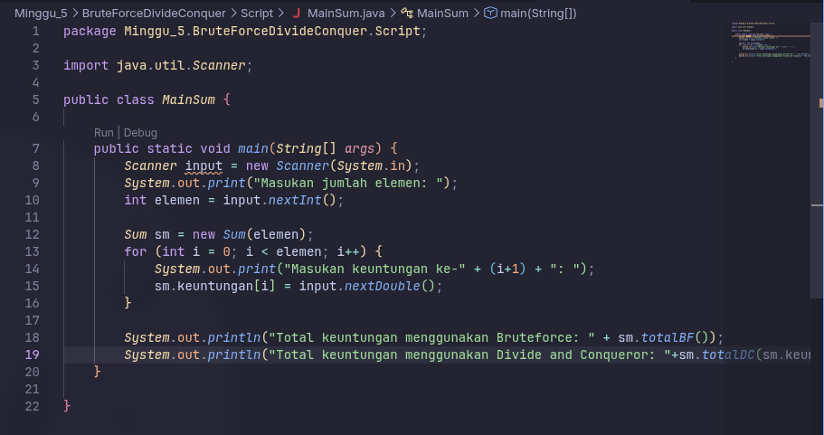 | 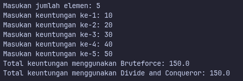 |
| 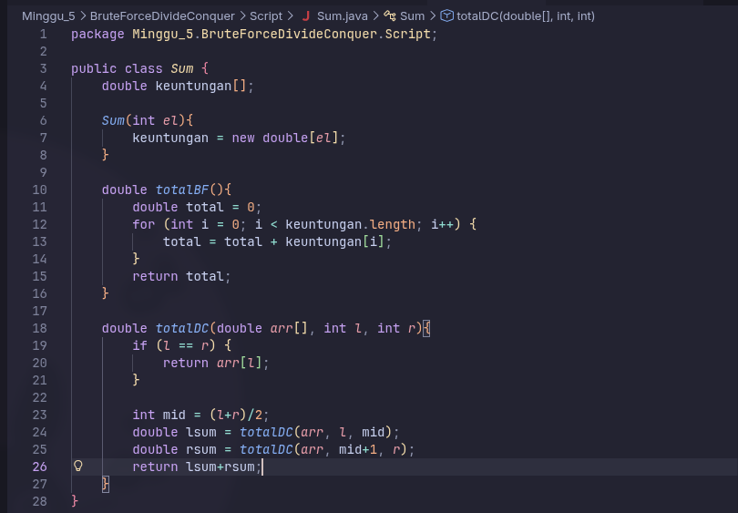 

### 1.2 Pertanyaan
1. **Kenapa dibutuhkan variable mid pada method TotalDC()?**
    
    * Variabel mid berfungsi sebagai titik tengah untuk membelah array menjadi dua bagian yang lebih kecil. Tanpa mid, program tidak akan tahu di mana bagian kiri (left) berakhir dan bagian kanan (right) dimulai.

2. **Untuk apakah statement di bawah ini dilakukan dalam TotalDC()?**
    ```java
        double lsum = totalDC(arr, l, mid);
        double rsum = totalDC(arr, mid+1, r);
    ```

    * lsum: Menghitung jumlah elemen di bagian kiri (dari indeks l sampai mid).
    * rsum: Menghitung jumlah elemen di bagian kanan (dari indeks mid+1 sampai r).

3. **Kenapa diperlukan penjumlahan hasil lsum dan rsum seperti di bawah ini?**

    * Baris return lsum + rsum; adalah tahap "Combine" (Penggabungan) dalam algoritma Divide and Conquer.

4. **Apakah base case dari totalDC()?**

    * Base case ini tercapai ketika rentang data yang diperiksa hanya menyisakan satu elemen saja (indeks kiri sama dengan indeks kanan).

5. **Tarik Kesimpulan tentang cara kerja totalDC()**

    * Metode TotalDC() bekerja dengan prinsip Divide and Conquer, di mana array terus dibelah menjadi dua bagian (kiri dan kanan) menggunakan variabel mid secara rekursif hingga mencapai base case (saat l == r atau tersisa satu elemen). Setelah mencapai titik terkecil tersebut, nilai elemen tunggal dikembalikan dan dijumlahkan secara bertahap melalui variabel lsum dan rsum saat alur rekursi kembali naik ke atas. Hasil akhirnya adalah akumulasi seluruh elemen array yang telah digabungkan kembali menjadi satu nilai total yang utuh.

---

## Latihan 1

**File Kode:** [Mahasiswa.java](Script/Mahasiswa.java) 
[LatihanPraktikum.java](Script/LatihanPraktikum.java)

### 1.1 Langkah-langkah & Dokumentasi
| Kode Program | Hasil Running |
| :---: | :---: |
| 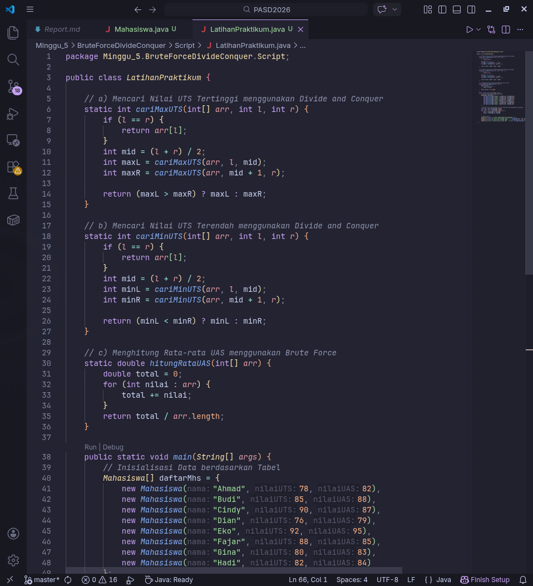 | 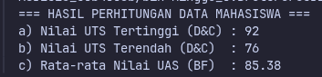 |
| 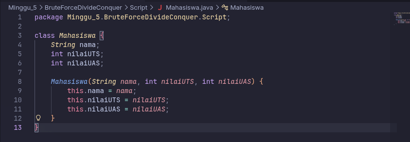 |  

---