# Laporan Praktikum - Algoritma dan Struktur Data

| Data Mahasiswa | Keterangan |
|:--- |:--- |
| **NIM** | 254107020006 |
| **Nama** | Jonathan Emmanuel Kristanto |
| **Kelas** | TI - 1F |
| **Repository** | [ZhayaGT/PASD2026](https://github.com/ZhayaGT/PASD2026) |

---

# Jobsheet #6: SORTING (BUBBLE, SELECTION, DAN INSERTION SORT)

## Praktikum 1 - Mengimplementasikan Sorting menggunakan object

**File Kode:** [Sorting16.java](/Minggu_6/Praktikum05/Script/Sorting16.java) [SortingMain16.java](/Minggu_6/Praktikum05/Script/SortingMain16.java)

### 1.1 Langkah-langkah Percobaan & Dokumentasi
### SORTING – BUBBLE SORT
| Kode Program | Hasil Running |
| :---: | :---: |
| 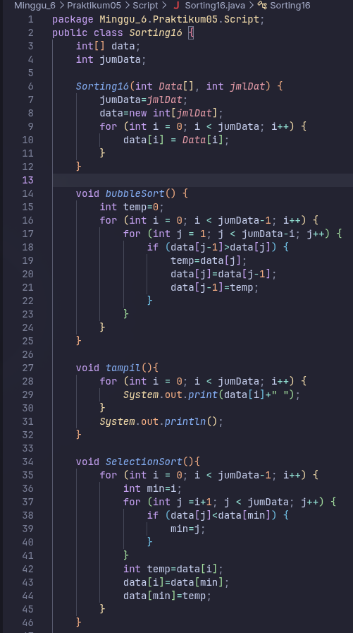 | 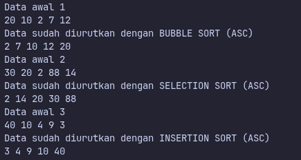 |
| 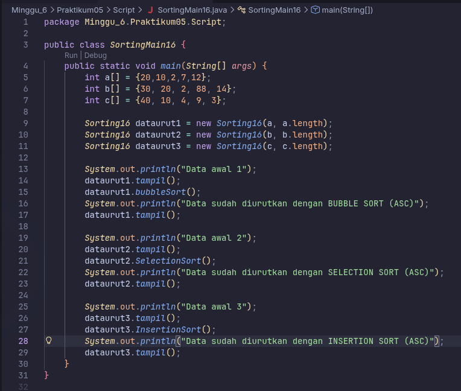 

### 1.2 Pertanyaan
1. **Jelaskan fungsi kode program berikut**
     ```java
        if (data[j-1]>data[j]) {
            temp=data[j];
            data[j]=data[j-1];
            data[j-1]=temp;
        }
    ```
    * Memeriksa apakah elemen diseblah kiri lebih besar atau tidak, jika iya maka kedua elemen tersbut akan ditukar dengan bantuan variabel temp

2. **Tunjukkan kode program yang merupakan algoritma pencarian nilai minimum pada selection sort!**

     ```java
        for (int j =i+1; j < jumData; j++) {
            if (data[j]<data[min]) {
                min=j;
            }
        }
        ``` 

3. **Pada Insertion sort ,jelaskan maksud dari kondisi pada perulangan**
    ```java
        while (j>=0 && data[j]>temp)
    ```

    * Kondisi ini digunakan pada Insertion Sort untuk menentukan kapan pergeseran elemen harus berhenti:

4. **Pada Insertion sort, apakah tujuan dari perintah**
    ```java
        data[j+1]=data[j];
    ```

    * Untuk menggeser elemen ke posisi kanan (satu baris ke depan). Hal ini dilakukan untuk memberikan ruang kosong (slot) bagi variabel temp agar bisa disisipkan pada posisi yang benar di dalam bagian array yang sudah terurut.
---

## Percobaan #2 Praktikum 2-(Sorting Menggunakan Array of Object) 

**File Kode:** [Mahasiswa16.java](/Minggu_6/Praktikum05/Script/Mahasiswa16.java) [MahasiswaBerprestasi16.java](/Minggu_6/Praktikum05/Script/MahasiswaBerprestasi16.java)
[MahasiswaDemo16.java](/Minggu_6/Praktikum05/Script/MahasiswaDemo16.java)

### 1.1 Langkah-langkah Percobaan & Dokumentasi
| Kode Program | Hasil Running |
| :---: | :---: |
| 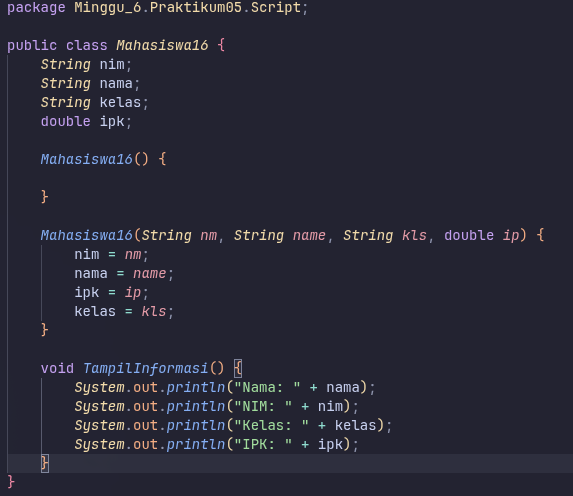 | 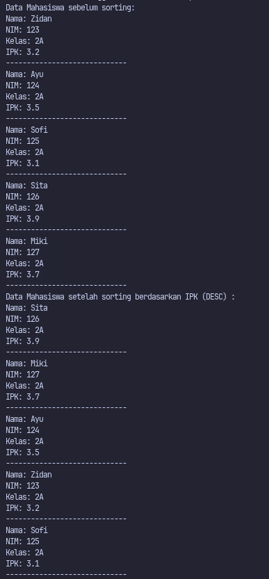 |
| 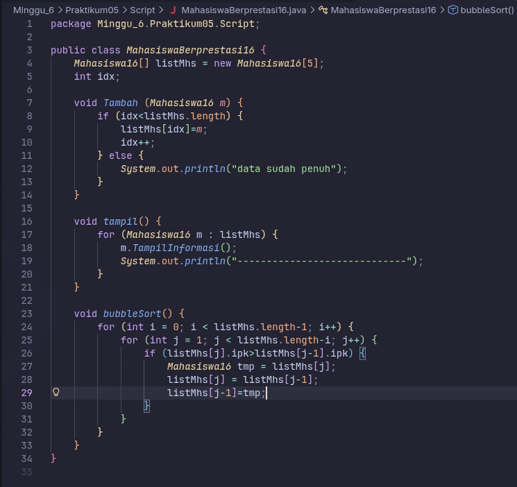 
  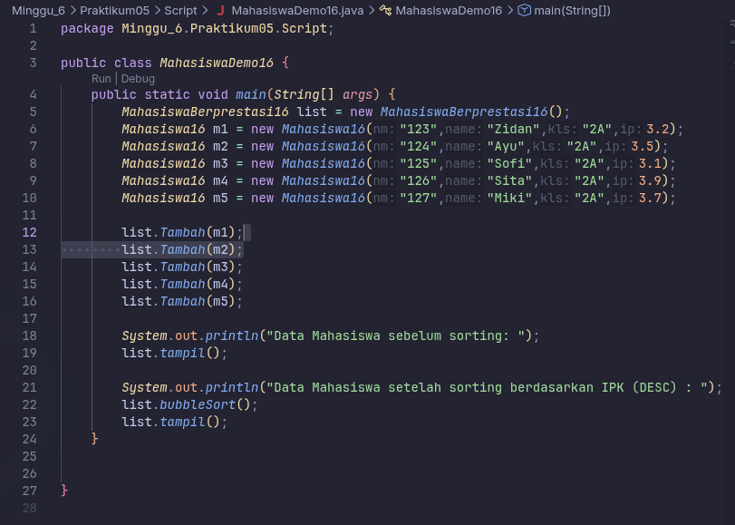 

### 1.2 Pertanyaan
1. **Perhatikan perulangan di dalam bubbleSort() di bawah ini**
    ```java
        for (int i = 0; i < listMhs.length-1; i++) {
            for (int j = 1; j < listMhs.length-i; j++) {
    ```

    * Karena dalam algoritma Bubble Sort dengan n data, kita hanya membutuhkan maksimal n - 1 langkah (iterasi luar) untuk memastikan seluruh data terurut.
    * Dengan menggunakan - i, kita menghindari pengecekan ulang terhadap elemen-elemen di posisi belakang yang sudah terurut. Hal ini membuat algoritma menjadi lebih efisien.
    * 49 kali
        
2. **Modifikasi program diatas dimana data mahasiswa bersifat dinamis (input dari keyborad) yang terdiri dari nim, nama, kelas, dan ipk!**

    ```java
        Scanner sc = new Scanner(System.in);
        MahasiswaBerprestasi16 list = new MahasiswaBerprestasi16();
        
        System.out.print("Masukkan jumlah mahasiswa: ");
        int jmlMhs = sc.nextInt();
        sc.nextLine(); 

        for (int i = 0; i < jmlMhs; i++) {
            System.out.println("--- Masukkan Data Mahasiswa ke-" + (i + 1) + " ---");
            System.out.print("NIM   : ");
            String nim = sc.nextLine();
            System.out.print("Nama  : ");
            String nama = sc.nextLine();
            System.out.print("Kelas : ");
            String kelas = sc.nextLine();
            System.out.print("IPK   : ");
            double ipk = sc.nextDouble();
            sc.nextLine();

            Mahasiswa16 m = new Mahasiswa16(nim, nama, kelas, ipk);
            list.Tambah(m);
        }
    ```
## 5.3.5 Mengurutkan Data Mahasiswa Berdasarkan IPK (Selection Sort)
| Kode Program | Hasil Running |
| :---: | :---: |
| 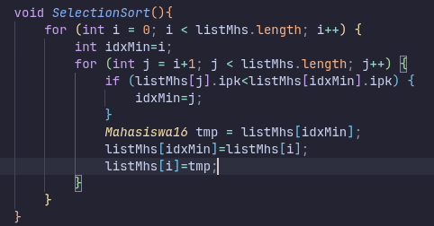 | 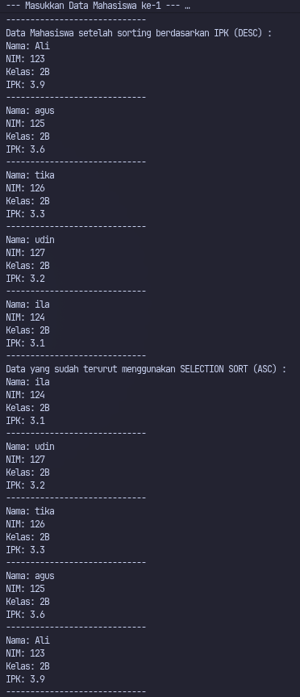 |

### 1.2 Pertanyaan
1. **Di dalam method selection sort, terdapat baris program seperti di bawah ini:**
    ```java
        int idxMin=i;
            for (int j = i+1; j < listMhs.length; j++) {
                if (listMhs[j].ipk<listMhs[idxMin].ipk) {
                    idxMin=j;
                }
    ```

    * Tujuan dari proses ini adalah menandai atau mengunci posisi (indeks) elemen dengan IPK terkecil dalam rentang data yang belum terurut. Setelah perulangan j selesai, nilai pada listMhs[idxMin] barulah akan ditukar (swap) ke posisi depan (indeks i) untuk mengurutkan data secara menaik (ascending).

## 5.4 Mengurutkan Data Mahasiswa Berdasarkan IPK Menggunakan Insertion Sort
| Kode Program | Hasil Running |
| :---: | :---: |
| 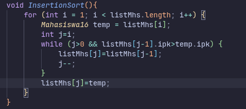 | 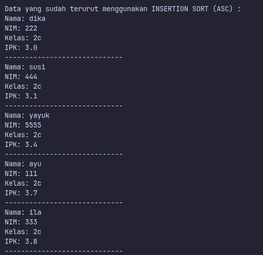 |

### 1.2 Pertanyaan
1. **Ubahlah fungsi pada InsertionSort sehingga fungsi ini dapat melaksanakan proses sorting dengan cara descending**
    ```java
        void InsertionSort() {
            for (int i = 1; i < listMhs.length; i++) {
                Mahasiswa16 temp = listMhs[i];
                int j = i;
                // Cukup ubah operator '>' menjadi '<'
                while (j > 0 && listMhs[j - 1].ipk < temp.ipk) { 
                    listMhs[j] = listMhs[j - 1];
                    j--;
                }
                listMhs[j] = temp;
            }
        }
    ```

---


## 5.5 Latihan Praktikum

**File Kode:** [DataDosen16.java](Script/DataDosen16.java) 
[Dosen16.java](Script/Dosen16.java)
[DosenMain16.java](Script/DosenMain16.java)

### 1.1 Langkah-langkah & Dokumentasi
| Kode Program | Hasil Running |
| :---: | :---: |
| 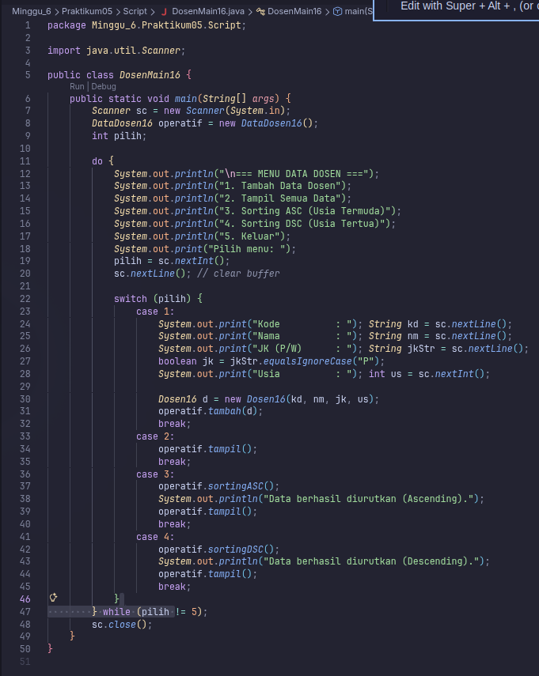 | 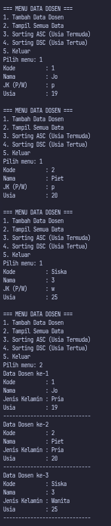 |
| 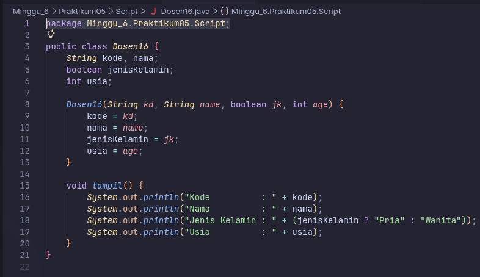 | 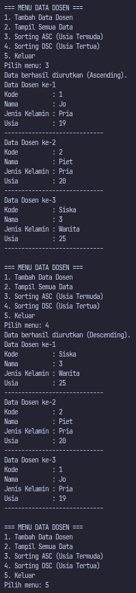 |
| 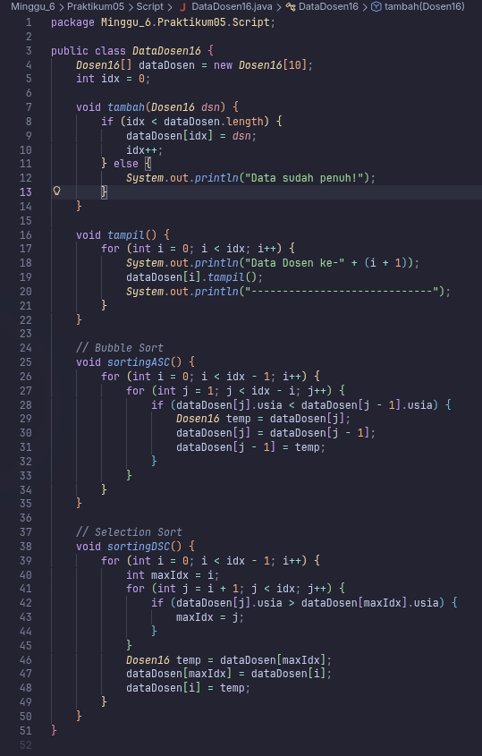 |  

---