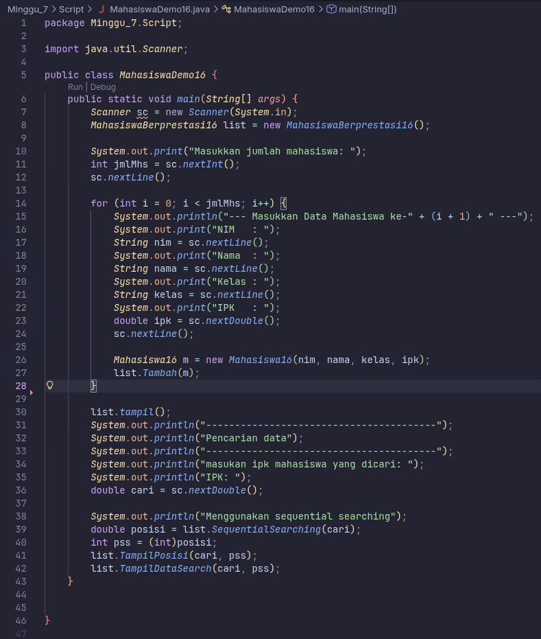
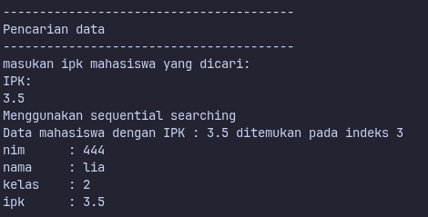
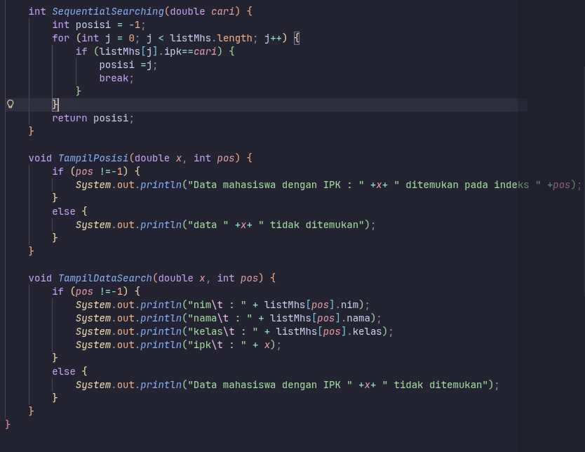
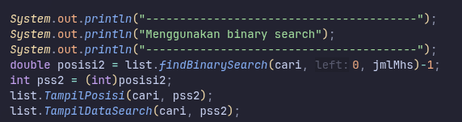
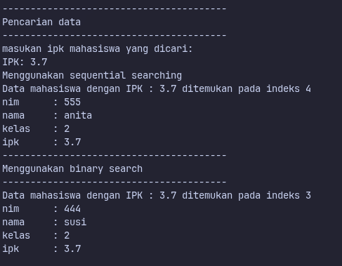
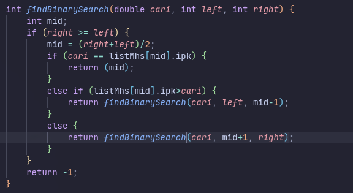

# Laporan Praktikum - Algoritma dan Struktur Data

| Data Mahasiswa | Keterangan |
|:--- |:--- |
| **NIM** | 254107020006 |
| **Nama** | Jonathan Emmanuel Kristanto |
| **Kelas** | TI - 1F |
| **Repository** | [ZhayaGT/PASD2026](https://github.com/ZhayaGT/PASD2026) |

---

# Jobsheet #7 SEARCHING

## Searching/ Pencarian Menggunakan Algoritma Sequential Search

**File Kode:** [Sorting16.java](/Minggu_6/Praktikum05/Script/Sorting16.java) [SortingMain16.java](/Minggu_6/Praktikum05/Script/SortingMain16.java)

### 1.1 Langkah-langkah Percobaan & Dokumentasi
### SORTING – BUBBLE SORT
| Kode Program | Hasil Running |
| :---: | :---: |
|  |  |
|  

### 1.2 Pertanyaan
1. **Jelaskan perbedaan metod tampilDataSearch dan tampilPosisi pada class MahasiswaBerprestasi!**
     
    * TampilPosisi: untuk menemukan posisi index ipk mahasiswa yang dicari
    * TampilDataSearch: Untuk menampilkan data lengkap mahasiswa berdasarkan indeks yang dimasukan

2. **Jelaskan fungsi break pada kode program di bawah ini!**

     ```java
        if (listMhs[j].ipk==cari) {
                posisi =j;
                break;
            }
        ``` 

        * Ketika data yag dicari sudah ditemukan maka hentikan proses searching

3. **Apa fungsi variabel pos atau indeks hasil pencarian dalam program sequential search?**

    * Untuk menyimpan hasil dari indeks yang dicari

4. **Jika terdapat lebih dari satu data dengan nilai yang sama, hasil pencarian sequential search yang dibuat di atas akan menampilkan data ke berapa? Jelaskan.**
 
    * Data yang pertama kali ditemukan yang akan ditampilkan

5. **Berkaitan dengan pertanyaan nomor 2 di atas, apa yang terjadi jika perintah break dihapus dari kode di atas?**
 
    * Data yag ditampilkan adalah data yang terakhir kali ditemukan
---

## Percobaan #2 Praktikum 2-(Sorting Menggunakan Array of Object) 

**File Kode:** [Mahasiswa16.java](/Minggu_6/Praktikum05/Script/Mahasiswa16.java) [MahasiswaBerprestasi16.java](/Minggu_6/Praktikum05/Script/MahasiswaBerprestasi16.java)
[MahasiswaDemo16.java](/Minggu_6/Praktikum05/Script/MahasiswaDemo16.java)

### 1.1 Langkah-langkah Percobaan & Dokumentasi
| Kode Program | Hasil Running |
| :---: | :---: |
|  |  |
|  

### 1.2 Pertanyaan
1. **Tunjukkan pada kode program yang mana proses divide dijalankan!**

    ```java
        mid = (right + left) / 2;
    ```*
2. **Tunjukkan pada kode program yang mana proses conquer dijalankan!**

    ```java
        else if (listMhs[mid].ipk>cari) {
                return findBinarySearch(cari, left, mid-1);
            }
            else {
                return findBinarySearch(cari, mid+1, right);
            }
    ```

3. **Apa fungsi left, right, dan mid?**

    * left: Menyimpan indeks paling kiri (batas bawah) dari rentang pencarian yang sedang diperiksa.

    * right: Menyimpan indeks paling kanan (batas atas) dari rentang pencarian yang sedang diperiksa

    * mid: Menyimpan indeks tengah yang dihitung dari (left + right) / 2. Indeks ini digunakan sebagai titik pembanding utama dengan nilai yang dicari

4. **Jika data IPK yang dimasukkan tidak urut. Apakah program masih dapat berjalan? Mengapa demikian?**

    * Program tetap akan berjalan (tidak akan crash atau error), namun hasilnya tidak akurat. Karena Binary Search bekerja dengan asumsi bahwa data sudah terurut. Jika data acak, logika pembuangan "setengah bagian" tidak akan berlaku.

5. **Jika IPK yang dimasukkan dari IPK terbesar ke terkecil (misal: 3.8, 3.7, 3.5, 3.4, 3.2) dan elemen yang dicari adalah 3.2. Bagaimana hasil dari binary search? Apakah sesuai? Jika tidak sesuai maka
ubahlah kode program binary seach agar hasilnya sesuai**

    * hasil Binary Search asli tidak akan menemukannya. Hal ini dikarenakan logika pada kode Anda dikhususkan untuk data Ascending (terkecil ke terbesar).

    ```java
        int findBinarySearchDescending(double cari, int left, int right) {
        int mid;
        if (right >= left) {
            mid = (right + left) / 2;
            if (cari == listMhs[mid].ipk) {
                return (mid);
            }
           
            else if (listMhs[mid].ipk < cari) { 
                return findBinarySearchDescending(cari, left, mid - 1);
            }
          
            else {
                return findBinarySearchDescending(cari, mid + 1, right);
            }
        }
        return -1;
    }
    ```

6. **Jelaskan bagaimana binary search menentukan bahwa data yang dicari tidak ditemukan di dalam array.**

    * Binary Search menentukan bahwa data tidak ditemukan ketika nilai left sudah lebih besar daripada right (left > right).

7. **Modifikasi program di atas yang mana jumlah mahasiswa yang diinputkan sesuai dengan masukan dari keyboard.**

    ```java
        public class MahasiswaBerprestasi16 {
        Mahasiswa16[] listMhs; 
        int idx;

        public MahasiswaBerprestasi16(int jumlah) {
            listMhs = new Mahasiswa16[jumlah];
        }
    }
    ```

    ```java
        public static void main(String[] args) {
        Scanner sc = new Scanner(System.in);
        
        System.out.print("Masukkan jumlah mahasiswa: ");
        int jmlMhs = sc.nextInt();
        sc.nextLine(); 

        // Inisialisasi list dengan jumlah yang diinputkan
        MahasiswaBerprestasi16 list = new MahasiswaBerprestasi16(jmlMhs);
        
        for (int i = 0; i < jmlMhs; i++) {
            // ... (proses input data sama seperti sebelumnya) ...
            Mahasiswa16 m = new Mahasiswa16(nim, nama, kelas, ipk);
            list.Tambah(m);
        }
        
        // Saat memanggil binary search, gunakan jmlMhs - 1 sebagai batas kanan (right)
        System.out.println("Menggunakan binary search");
        int posisi2 = list.findBinarySearch(cari, 0, jmlMhs - 1); 
        list.TampilPosisi(cari, posisi2);
        list.TampilDataSearch(cari, posisi2);   
    }
    ```
    