# Laporan Praktikum - Algoritma dan Struktur Data

| Data Mahasiswa | Keterangan |
|:--- |:--- |
| **NIM** | 254107020006 |
| **Nama** | Jonathan Emmanuel Kristanto |
| **Kelas** | TI - 1F |
| **Repository** | [ZhayaGT/PASD2026](https://github.com/ZhayaGT/PASD2026) |

---

# Jobsheet #9 STACK
## Percobaan 1: Mahasiswa Mengumpulkan Tugas

**File Kode:** [Mahasiswa16.java](Script/Mahasiswa16.java) [MahasiswaDemo16.java](Script/MahasiswaDemo16.java) [StackTugasMahasiswa16.java](Script/StackTugasMahasiswa16.java)

| Kode Program | Hasil Running |
| :---: | :---: |
| 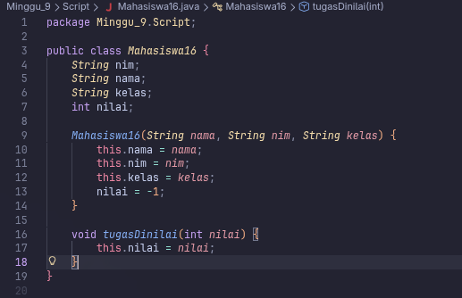 | 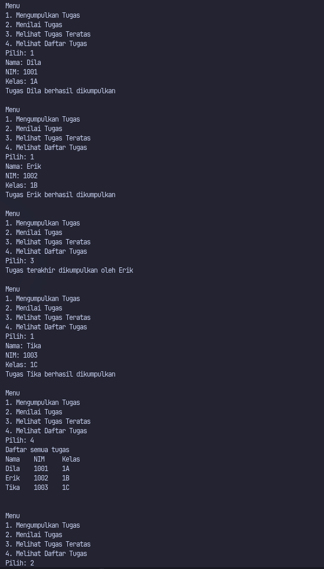 |
| 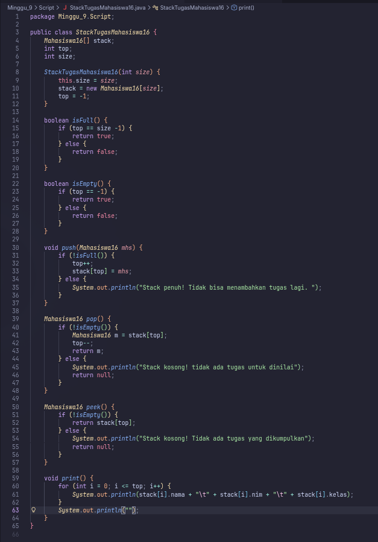 
| 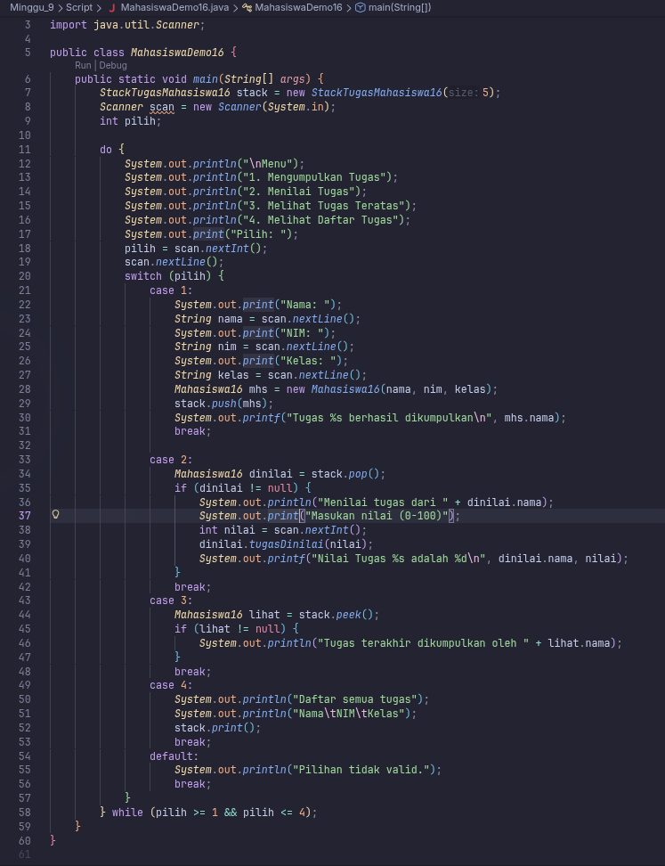 

### 1.2 Pertanyaan
1. **Jelaskan perbedaan metod tampilDataSearch dan tampilPosisi pada class MahasiswaBerprestasi!**
     ```java
        void print() {
            for (int i = top; i >= 0; i--) {
                System.out.println(stack[i].nama + "\t" + stack[i].nim + "\t" + stack[i].kelas);
            }
            System.out.println("");
        }
    }
     ```

2. **Berapa banyak data tugas mahasiswa yang dapat ditampung di dalam Stack? Tunjukkan potongan kode programnya!**
    * 5 data
    ```java
        StackTugasMahasiswa16 stack = new StackTugasMahasiswa16(5);
    ```

3. **Mengapa perlu pengecekan kondisi !isFull() pada method push? Kalau kondisi if-else tersebut dihapus, apa dampaknya?**

    * Maka array akan out of bound, atau error sehingga semua data yg ditulis sebelumnya akan hilang karena error da harus dijalankan ulang

4. **Modifikasi kode program pada class MahasiswaDemo dan StackTugasMahasiswa sehingga pengguna juga dapat melihat mahasiswa yang pertama kali mengumpulkan tugas melalui operasi lihat tugas terbawah!**
    ```java
        Mahasiswa16 peekBottom() {
            if (!isEmpty()) {
                return stack[0]; 
            } else {
                System.out.println("Stack kosong! Tidak ada tugas yang dikumpulkan");
                return null;
            }
        }

        System.out.println("1. Mengumpulkan Tugas");
        System.out.println("2. Menilai Tugas");
        System.out.println("3. Melihat Tugas Teratas");
        System.out.println("4. Melihat Tugas Terbawah"); // Tambahan Menu Baru
        System.out.println("5. Melihat Daftar Tugas");

        case 4:
            Mahasiswa16 bawah = stack.peekBottom();
            if (bawah != null) {
                System.out.println("Mahasiswa pertama yang mengumpulkan tugas: " + bawah.nama);
                System.out.println("NIM: " + bawah.nim);
            }
            break;
    ```

5. **Tambahkan method untuk dapat menghitung berapa banyak tugas yang sudah dikumpulkan saat ini, serta tambahkan operasi menunya!**

    ```java
        int hitungTugas() {
            // Jika top = -1, berarti 0 tugas. Jika top = 0, berarti 1 tugas, dst.
            return top + 1;
        }

        System.out.println("1. Mengumpulkan Tugas");
        System.out.println("2. Menilai Tugas");
        System.out.println("3. Melihat Tugas Teratas");
        System.out.println("4. Melihat Tugas Terbawah");
        System.out.println("5. Hitung Jumlah Tugas"); // Menu Baru
        System.out.println("6. Melihat Daftar Tugas");
        System.out.print("Pilih: ");
        pilih = scan.nextInt();
        scan.nextLine();

        switch (pilih) {
            case 5:
                int jumlah = stack.hitungTugas();
                System.out.println("Jumlah tugas yang sudah dikumpulkan saat ini: " + jumlah);
                break;
        }
    ```
---

## Percobaan #2 Praktikum 2-(Sorting Menggunakan Array of Object) 

**File Kode:** [Mahasiswa16.java](Script/Mahasiswa16.java) [MahasiswaDemo16.java](Script/MahasiswaDemo16.java) [StackKonversi16.java](Script/StackKonversi16.java) [StackTugasMahasiswa.java](Script/StackTugasMahasiswa16.java)

### 1.1 Langkah-langkah Percobaan & Dokumentasi
| Kode Program | Hasil Running |
| :---: | :---: |
| 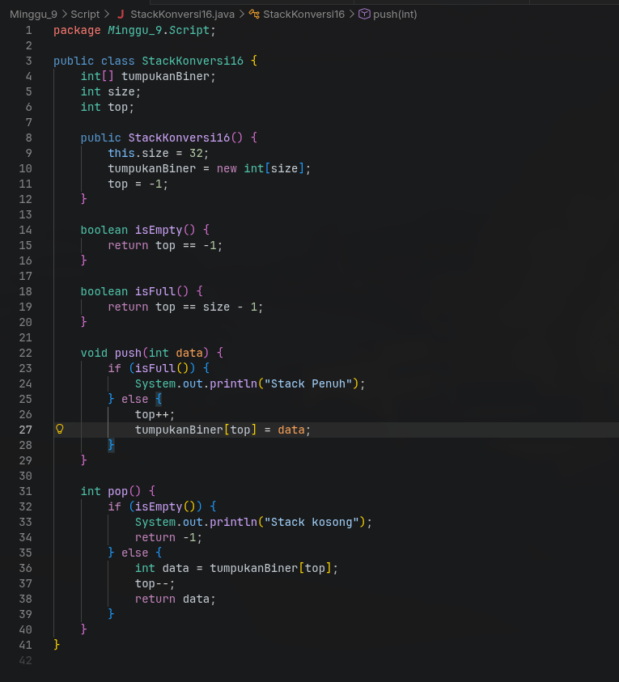 | 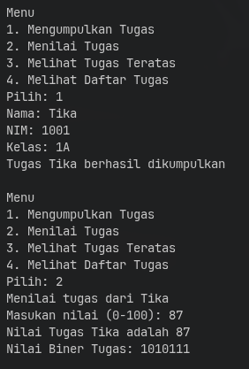 |
| 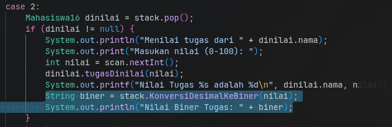 

### 1.2 Pertanyaan
1. **Jelaskan alur kerja dari method konversiDesimalKeBiner!**

    * Alur kerja method KonversiDesimalKeBiner dimulai dengan menerima parameter nilai desimal, lalu melakukan pembagian berulang dengan angka 2 untuk mendapatkan sisa bagi (modulus) yang kemudian dimasukkan ke dalam objek StackKonversi16 melalui operasi push. Setelah semua sisa bagi tersimpan dan nilai desimal mencapai nol, program melakukan perulangan kedua untuk mengambil data dari stack menggunakan operasi pop satu per satu hingga stack kosong. Karena sifat stack adalah Last-In-First-Out (LIFO), sisa bagi yang terakhir masuk akan keluar pertama kali, sehingga susunan angka tersebut membentuk string representasi biner yang benar saat digabungkan.

2. **Pada method konversiDesimalKeBiner, ubah kondisi perulangan menjadi while (kode != 0), bagaimana hasilnya? Jelaskan alasannya!**

    * Jika kondisi perulangan diubah menjadi while (nilai != 0), hasilnya akan tetap sama dan tetap berjalan dengan benar untuk input bilangan positif. Hal ini terjadi karena dalam konteks pembagian bilangan bulat positif secara terus-menerus, kondisi nilai > 0 dan nilai != 0 memiliki titik henti yang identik, yaitu saat variabel nilai mencapai angka 0. Namun, penggunaan != 0 secara teknis lebih fleksibel jika sistem nantinya harus menangani input bilangan negatif, meskipun pada kasus nilai tugas mahasiswa (0-100) kedua kondisi tersebut tidak memberikan perbedaan fungsional pada hasil akhirnya.

---

## TUGAS

**File Kode:** [SuratDemo16.java](Script/SuratDemo16.java) [StackSurat16.java](Script/StackSurat16.java) [Surat16.java](Script/Surat16.java) 

### 1.1 Langkah-langkah Percobaan & Dokumentasi
| Kode Program | Hasil Running |
| :---: | :---: |
| 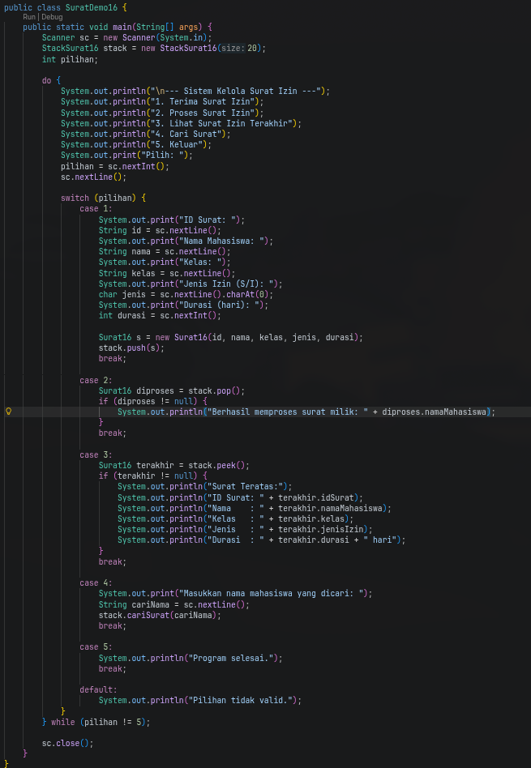 | 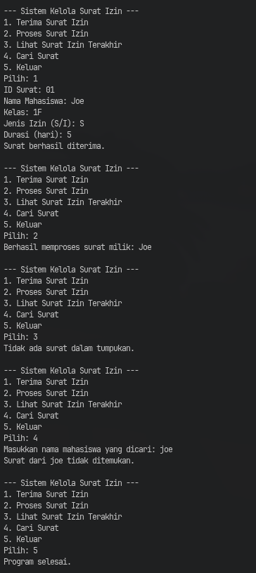 |
| 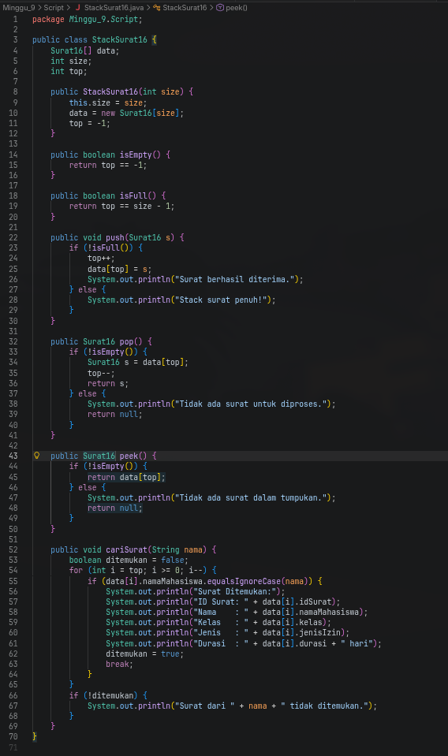 
| 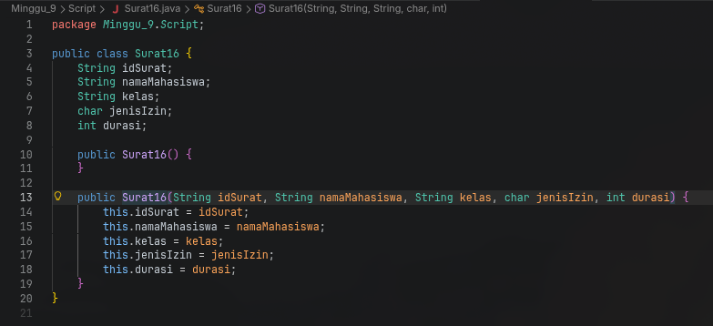 